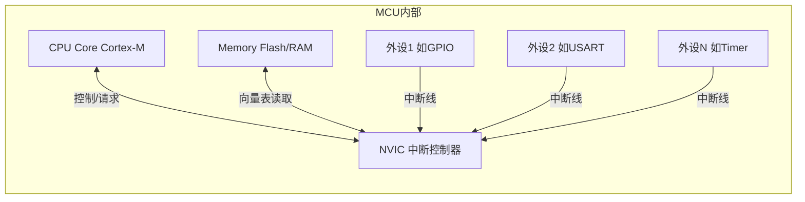
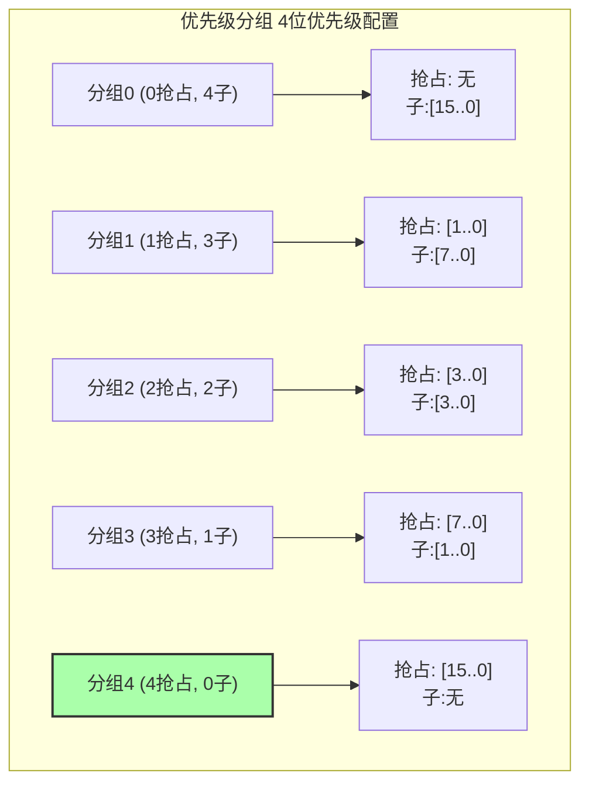

今天我们聊一聊ARM Cortex-M中断处理。在嵌入式系统中，中断是实现实时响应的核心机制。想象一下，如果没有中断：
- 按键按下时，系统可能忙于其他任务而错过响应
- 通信数据到来时，可能因为没及时处理而丢失
- 定时任务难以精确执行，系统时序混乱
中断就像是微控制器世界的"VIP通道"，让重要事件能够立即得到处理，而不必排队等待。

### **Cortex-M中断系统架构**

ARM Cortex-M系列的中断系统是其最强大的特性之一，比传统的8位、16位单片机先进许多。它的核心是**NVIC (嵌套向量中断控制器)**。

> 知识点：与传统8051等单片机不同，Cortex-M的中断系统完全由硬件实现向量跳转和状态保存，大大提高了中断响应速度。

**一张图看懂NVIC在系统中的位置：**



#### **NVIC的强大特性：**

- **快速中断响应**：从中断触发到执行ISR仅需12-20个CPU时钟周期
- **支持中断嵌套**：高优先级中断可以打断低优先级中断的执行
- **动态优先级调整**：软件可以在运行时修改中断优先级
- **待处理中断管理**：可以软件触发或取消待处理的中断
- **向量化中断处理**：每个中断源对应唯一的中断服务函数


### **中断向量表详解**

MCU一上电，除了设置堆栈指针（MSP），最重要的就是找到**中断向量表**。这张表就像一张地图，告诉CPU：发生某个中断或异常时，该去哪里找对应的处理程序（ISR - Interrupt Service Routine）。

```c
__attribute__((section(".isr_vector"))) // 确保放在指定段
void (* const g_pfnVectors[])(void) = {
    (void *)&_estack,           // 0. 栈顶地址 (MSP初始值)
    Reset_Handler,              // 1. 复位中断处理函数
    NMI_Handler,                // 2. NMI (不可屏蔽中断)
    HardFault_Handler,          // 3. 硬件错误 (非常重要！)
    MemManage_Handler,          // 4. 内存管理错误
    BusFault_Handler,           // 5. 总线错误
    UsageFault_Handler,         // 6. 使用错误
    0, 0, 0, 0,                 // 7-10. 保留
    SVC_Handler,                // 11. 系统服务调用 (RTOS常用)
    DebugMon_Handler,           // 12. 调试监视器
    0,                          // 13. 保留
    PendSV_Handler,             // 14. 可挂起系统调用 (RTOS上下文切换关键！)
    SysTick_Handler,            // 15. 系统滴答定时器 (RTOS心跳、延时基础)
    // --- 从这里开始是外部中断 (IRQ) ---
    WWDG_IRQHandler,            // 16. 窗口看门狗中断
    PVD_IRQHandler,             // 17. 电源电压检测中断
    // ... 根据具体MCU型号，后面还有一长串外设中断
};
```

>  **踩坑实录：** 曾经遇到个诡异问题，程序在某个外设中断后行为异常。查了半天，发现是向量表里这个外设的ISR指针被意外改成了NULL！所以，**务必检查你的向量表是否正确、完整！** 特别是用了Bootloader或者修改了启动文件后。另外，记住向量表地址可以通过`VTOR`寄存器重定位，搞清楚它在哪儿很重要！

### **中断优先级系统**

中断不是先到先得，而是按“级别”说话！NVIC有一套精密的优先级系统，决定了哪个中断能“插队”，哪个得“排队”。

#### **核心概念：**
1.  **抢占优先级 (Preemption Priority):** 决定一个中断能不能打断另一个正在执行的中断。级别高的可以打断级别低的。
2.  **子优先级 (Sub-priority):** 当两个中断的**抢占优先级相同**时，子优先级高的先执行。

（注意：如果一个中断已经在执行，另一个具有**相同抢占优先级**的中断即使来了，也**不能打断**当前正在执行的中断。子优先级仅在多个具有相同抢占优先级的中断**同时挂起**时起作用，用于决定**当前中断服务程序结束后**，下一个应该响应哪一个挂起的中断（子优先级数值小的优先））。

#### **关键配置：优先级分组 (Priority Grouping)**

这玩意儿决定了你有几位用于抢占优先级，几位用于子优先级。通过`NVIC_SetPriorityGrouping()`函数设置，**整个系统通常只设置一次！**

**一张图看懂优先级分组（以常见的4位优先级为例）：**



#### **如何设置优先级？**

> ⚠ **高能预警！新手必看！**
> 在Cortex-M里，**优先级数值越小，实际优先级越高！** 比如，优先级0 > 优先级1 > 优先级15。别记反了！

```c
// 1. 设置优先级分组 (通常在系统初始化时)
NVIC_SetPriorityGrouping(NVIC_PRIORITYGROUP_4); // 例如：全用作抢占优先级

// 2. 设置具体中断的优先级
// NVIC_EncodePriority(优先级分组, 抢占优先级, 子优先级)
// 注意：这里的数值越小，优先级越高！
NVIC_SetPriority(USART1_IRQn, NVIC_EncodePriority(NVIC_GetPriorityGrouping(), 1, 0)); // USART1优先级设为1
NVIC_SetPriority(TIM2_IRQn,   NVIC_EncodePriority(NVIC_GetPriorityGrouping(), 5, 0)); // TIM2优先级设为5 (低于USART1)
```

**优先级位数差异：**

*   **Cortex-M0/M0+:** 通常只有2位（4个级别）或更少。
*   **Cortex-M3/M4/M7/M33等:** 支持更多位（如3-8位），但具体实现多少位由芯片厂商决定，常见是4位（16个级别）。

### **中断延迟与排队机制**

当多个中断同时触发或在处理一个中断时有新中断触发，NVIC会如何处理？当中断发生时，CPU并不能瞬间响应，会有一点点延迟。这个延迟主要包括：

1.  **硬件识别延迟：** 外设信号传到NVIC。 (极短)
2.  **同步延迟：** 等待当前指令完成。此外，从Flash取指令时的等待周期（Wait State）也会增加延迟。
3.  **NVIC处理：** 判断优先级，准备跳转。
4.  **上下文保存：** 硬件自动把R0-R3, R12, LR, PC, xPSR寄存器压栈。（约12个周期）

> 优化技巧：如果对中断延迟要求极高，可以将关键代码放入RAM执行，避免Flash等待状态的影响。

总延迟通常在12-20个时钟周期左右，已经非常快了！

**NVIC的“黑科技”：减少延迟**

*   **尾链 (Tail-Chaining):** 如果一个ISR刚执行完，马上有另一个中断挂起（且优先级允许执行），NVIC会跳过出栈、入栈过程，直接跳到下一个ISR，**延迟骤降到约6个周期！** 效率极高！
*   **晚到 (Late Arrival):** 如果一个高优先级中断在低优先级中断正在入栈时到达，NVIC会让高优先级的先执行，服务完了再回来执行低优先级的。

**排队规则总结：**

1.  **抢占为王：** 高抢占优先级中断 > 低抢占优先级中断。
2.  **同级看子：** 抢占优先级相同，子优先级高的先响应（但不能打断已在执行的同级）。
3.  **完全相同看编号：** 抢占和子优先级都相同，中断编号小的先响应。

### **中断处理函数的编写**

写好ISR（中断服务程序）是门艺术，直接关系到系统稳定性和实时性。请牢记以下黄金法则：

*   **简短快速**：ISR要尽可能短小精悍，只做最核心、最紧急的事。
*   **无阻塞**： 绝不能在ISR里用`HAL_Delay()`、等待标志位、死循环等耗时操作。
*   **设置标志，主体处理：** ISR里快速处理完硬件（如读数据、清标志），然后设置一个全局标志位，让主循环或RTOS任务去做复杂的后续处理。
*   **保护共享资源：** 如果ISR访问了主程序或其他中断也在用的全局变量/外设，必须加临界区保护（关中断/信号量等），否则数据就乱了！
*   **清除中断标志：** 处理完中断源，一定要记得清除对应的中断标志位，否则ISR会不停地重入，直到系统崩溃！

**ISR处理函数（以串口接收为例）：**

```c
volatile uint8_t g_uartRxData;
volatile uint8_t g_uartRxFlag = 0;

void USART1_IRQHandler(void)
{
    // 1. 判断中断源 (是接收中断吗?)
    if (LL_USART_IsActiveFlag_RXNE(USART1) && LL_USART_IsEnabledIT_RXNE(USART1))
    {
        // 2. 处理硬件 & 清除标志位 (核心！)
        g_uartRxData = LL_USART_ReceiveData8(USART1);
        // 关键：务必查阅MCU参考手册确认RXNE标志位如何清除！
		// 有些外设在读取数据寄存器后会自动清除，但显式清除（如果手册要求）或至少明确知道清除机制更安全。
        // LL_USART_ClearFlag_RXNE(USART1); // 确认是否需要手动清除

        // 3. 设置标志位，通知主程序
        g_uartRxFlag = 1;

        // 4. (可选) 如果用了RTOS，可能需要在这里发信号量/消息队列，并触发任务切换
        // BaseType_t xHigherPriorityTaskWoken = pdFALSE;
        // xQueueSendFromISR(g_uartRxQueue, &g_uartRxData, &xHigherPriorityTaskWoken);
        // portYIELD_FROM_ISR(xHigherPriorityTaskWoken);
    }

    // (可能还有其他中断源，如发送完成、错误等，需要一并处理)
    if (LL_USART_IsActiveFlag_TC(USART1) && LL_USART_IsEnabledIT_TC(USART1))
    {
        LL_USART_ClearFlag_TC(USART1); // 清除发送完成标志
        // ... 处理发送完成逻辑 ...
    }
}

// 主循环中检查标志位
int main(void)
{
    // ... 初始化 ...
    while (1)
    {
        if (g_uartRxFlag)
        {
            g_uartRxFlag = 0; // 清除标志
            // 在这里处理接收到的数据 g_uartRxData
            process_received_data(g_uartRxData);
        }
        // ... 其他主循环任务 ...
    }
}
```

### **中断编程的常见陷阱**

**1. 忘记清除中断标志位！**

```c
// 错误示范 (定时器中断)
void TIM2_IRQHandler(void) {
    // 啊哦，处理了计数，但忘了清标志！
    timer_counter++;
}

// 正确姿势
void TIM2_IRQHandler(void) {
    if (LL_TIM_IsActiveFlag_UPDATE(TIM2)) { // 检查是不是更新中断
        LL_TIM_ClearFlag_UPDATE(TIM2);     // 先清标志！好习惯！
        timer_counter++;
    }
}
```

**2. ISR里执行耗时操作！**

```c
// 错误示范 (串口收到数据就去写Flash)
void USART1_IRQHandler(void) {
    if(LL_USART_IsActiveFlag_RXNE(USART1)) {
        uint8_t data = LL_USART_ReceiveData8(USART1);
        // Flash操作非常耗时，会阻塞一切！
        Flash_ErasePage(ADDRESS);
        Flash_ProgramWord(ADDRESS, data);
    }
}

// 正确姿势
volatile uint8_t g_dataToFlash;
volatile uint8_t g_flashWriteRequest = 0;
void USART1_IRQHandler(void) {
    if(LL_USART_IsActiveFlag_RXNE(USART1)) {
        g_dataToFlash = LL_USART_ReceiveData8(USART1);
        g_flashWriteRequest = 1; // 设置请求标志
    }
}
// 主循环或任务中处理Flash写入
// if (g_flashWriteRequest) { ... }
```

**3.  共享资源不加保护！(数据混乱)**

```c
// 错误示范 (简单的环形缓冲区)
uint8_t buffer[100];
uint8_t write_idx = 0;
void USART1_IRQHandler(void) {
    // 假设主程序也在读写 write_idx
    buffer[write_idx++] = LL_USART_ReceiveData8(USART1); // 非原子操作，可能被打断
    if (write_idx >= 100) write_idx = 0;
}

// 正确姿势 (使用开关全局中断保护)
volatile uint8_t buffer[100];
volatile uint8_t write_idx = 0;
void USART1_IRQHandler(void) {
    uint32_t primask_status;
    primask_status = __get_PRIMASK(); // 保存当前中断状态
    __disable_irq(); // 关全局中断，进入临界区

    // --- 临界区代码 ---
    buffer[write_idx++] = LL_USART_ReceiveData8(USART1);
    if (write_idx >= 100) write_idx = 0;
    // --- 临界区结束 ---

    if (!primask_status) { // 如果原来是开中断状态，才恢复
        __enable_irq(); // 开全局中断
    }
}
// 注意：主程序访问write_idx时也要用同样的方法保护！
// RTOS下有更优雅的保护方式（如基于BASEPRI或使用信号量/互斥锁）
```
**注意：** `__disable_irq()` 会屏蔽所有中断，可能增加系统中其他高优先级中断的响应延迟。对于支持`BASEPRI`寄存器的Cortex-M核（如M3/M4/M7），在RTOS环境或需要精细控制中断屏蔽的场合，**更推荐**使用修改`BASEPRI`寄存器的方法，仅屏蔽低于等于特定优先级（如RTOS系统调用最高优先级）的中断。或者使用RTOS提供的互斥锁（Mutex）或信号量（Semaphore）来保护共享资源，这是更健壮和推荐的方式。
### **高级中断技巧**

当你用上FreeRTOS、RT-Thread这类实时操作系统时，中断处理需要更讲究策略。

**1. 使用RTOS提供的ISR安全API**

RTOS的很多API（如队列发送、信号量释放）都有专门的ISR版本（通常带`FromISR`后缀）。**必须使用这些版本！** 因为它们内部处理了上下文切换和临界区保护。

```c
// FreeRTOS示例：在ISR中发送数据到队列
void USART1_IRQHandler(void) {
    uint8_t data = LL_USART_ReceiveData8(USART1);
    BaseType_t xHigherPriorityTaskWoken = pdFALSE; // 用于判断是否需要任务切换

    // 使用 xQueueSendFromISR，而不是 xQueueSend
    xQueueSendFromISR(g_uartRxQueue, &data, &xHigherPriorityTaskWoken);

    // 如果发送操作唤醒了更高优先级的任务，手动触发一次调度
    portYIELD_FROM_ISR(xHigherPriorityTaskWoken);
}
```

**2. 软件触发中断 (PendSV / SVC)**

*   **PendSV:** 这是RTOS进行上下文切换的“御用”中断。它优先级最低，可以被其他中断打断，确保切换发生在安全时刻。通常由RTOS内核在需要切换时（如延时结束、任务唤醒）通过`SCB->ICSR |= SCB_ICSR_PENDSVSET_Msk;`来挂起。我们一般不需要直接操作它。
*   **SVC:** 用于实现系统调用。当用户任务需要请求内核服务（如创建任务、申请内存）时，会执行`SVC`指令触发此异常，从用户态陷入内核态执行，保证系统安全。

**3. 中断优先级与RTOS的规划**

这是RTOS系统稳定性的关键！原则是：

*   **RTOS配置：** 正确配置`configMAX_SYSCALL_INTERRUPT_PRIORITY`（FreeRTOS）或类似宏。**任何调用了ISR安全API的中断，其优先级数值必须 >= 这个宏定义的值（即实际优先级 <= 系统调用最高优先级）**。否则调用会出错！
*   **高实时性中断：** 对时间要求极其严格、处理极快的中断（如高速ADC采样触发），可以设置**高于**系统调用最高优先级。但这类ISR里绝对不能调用任何RTOS API！
*   **普通外设中断：** 优先级应**低于**系统调用最高优先级，可以使用ISR安全API。
*   **SysTick/PendSV：** 通常设置为最低优先级。

**优先级设置示例 (数值越小，优先级越高):**

*   `configMAX_SYSCALL_INTERRUPT_PRIORITY` = 5 (假设4位优先级，数值为5)
*   高速ADC中断优先级 = 3 (高于5，不能调RTOS API)
*   串口中断优先级 = 6 (低于等于5，可以调ISR安全API)
*   按键中断优先级 = 10 (低于等于5，可以调ISR安全API)
*   SysTick/PendSV优先级 = 15 (最低)

*简而言之：配置一个‘门槛’优先级。只有优先级等于或低于这个‘门槛’（即优先级数值大于等于`configMAX_SYSCALL_INTERRUPT_PRIORITY`）的中断服务程序，才能安全地调用RTOS的`FromISR` API。优先级高于‘门槛’（数值小于`configMAX_SYSCALL_INTERRUPT_PRIORITY`）的中断，则绝对禁止调用这些API，以保证RTOS内核的完整性。*

### **总结**

ARM Cortex-M的中断系统设计精良，功能强大，是实现高性能嵌入式系统的关键所在。掌握它的工作原理和使用技巧，能够帮助你:

1. 设计出实时性更强的系统
2. 降低功耗，提高电池寿命
3. 提高代码的可靠性和稳定性
4. 更高效地利用MCU资源

中断编程是一门艺术，需要理论与实践相结合。希望这篇文章能帮助你更好地理解和应用Cortex-M的中断系统！

### **常见问题解答**

**Q1: 中断处理函数为什么要加`__attribute__((interrupt))`（GCC/Clang）或`__irq`（ARM Compiler）?**

**A:** 这些属性告诉编译器这是一个中断函数，需要特殊处理。编译器会自动生成适当的函数入口和出口代码，包括保存和恢复寄存器状态。Cortex-M系列会自动保存部分寄存器，但有些寄存器可能需要编译器额外处理。不同编译器的语法可能有所不同。

**Q2: 为什么我的中断有时候不触发？**

**A:** 常见原因包括：1)没有正确配置中断源；2)忘记使能NVIC中对应的中断线；3)中断优先级设置不正确，被更高优先级的中断屏蔽；4)中断标志位在其他地方被误清除。系统地检查这些配置点，通常能解决问题。

**Q3: 如何测量中断响应时间？**

**A:** 一个简单的方法是在中断触发时设置一个GPIO引脚，在中断处理函数开始和结束时翻转另一个GPIO引脚，然后用示波器测量延迟。也可以使用调试器的ETM/ITM跟踪功能或性能计数器来获取更精确的测量。

**Q4: 在中断中使用printf安全吗？**

**A:** 一般不建议在中断中使用printf，因为它通常是阻塞的，执行时间长，会导致其他中断响应延迟。如果必须输出调试信息，建议使用高速缓冲区记录数据，在主循环中再输出，或者使用专为中断设计的轻量级日志函数。

**Q5: PendSV、SVC和SysTick中断有什么区别和联系？**

**A:** 这三者都是Cortex-M的系统级中断：
- **SysTick**：系统节拍定时器中断，用于产生固定频率的时间基准，常用于RTOS的时间片切换
- **SVC**：服务调用中断，通过svc指令触发，常用于用户态到特权态的切换
- **PendSV**：可挂起的系统调用，常用于RTOS中的任务切换，优点是其优先级通常设置为最低，并且是可挂起的（Pendable），这意味着它只会在没有其他更高优先级中断活动时才执行，为RTOS提供了一个进行上下文切换（这通常比普通ISR耗时）的安全时间点，避免了切换过程中被其他中断打断的复杂性。