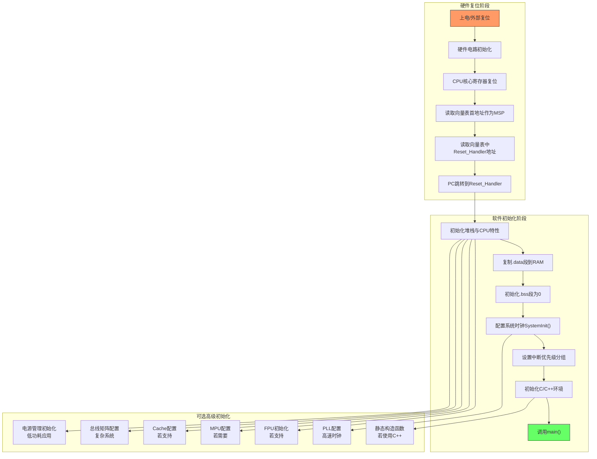
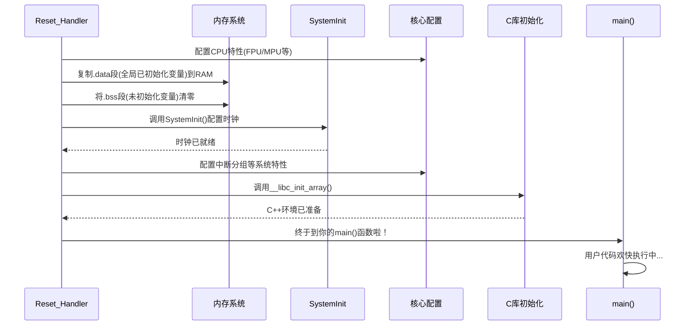
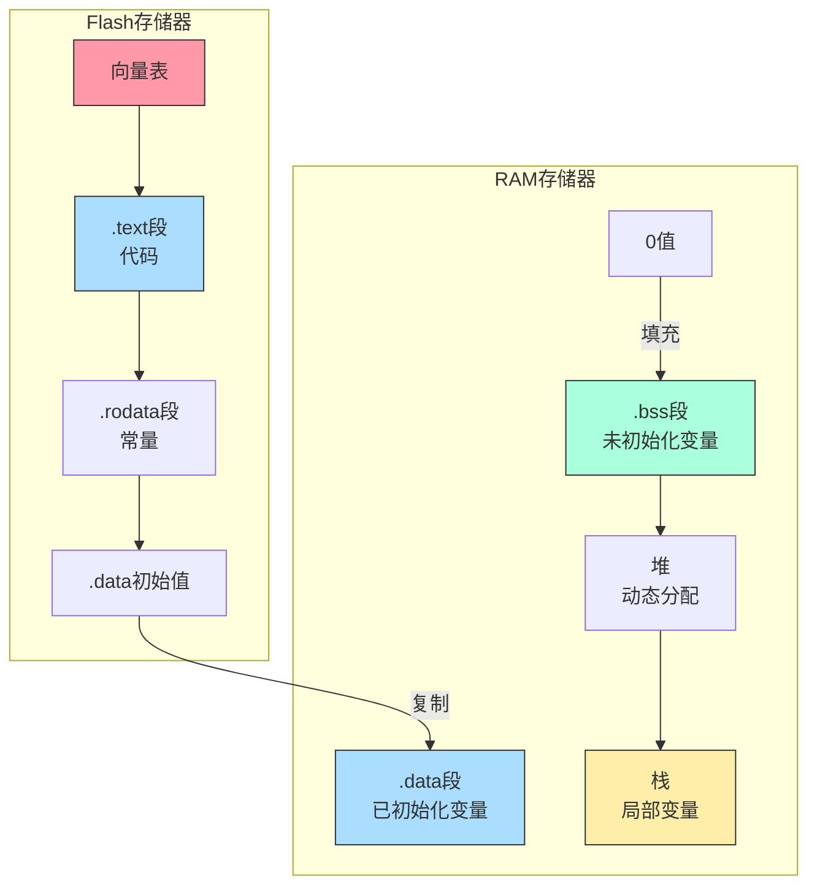

今天和大家深入探讨一个看似基础却经常被忽视的话题 —— 当你按下复位按钮的那一刻，到你的`main()`函数开始执行，这中间究竟发生了什么？

### **启动流程全景图：系统苏醒之旅**

想象一下，你的MCU就像一个刚被唤醒的机器人。它需要先穿好衣服(加载堆栈)，了解自己的使命(读取向量表)，然后才能开始工作(执行代码)。这个过程精确而优雅：




### **上电瞬间：硬件接管一切**

当电源键按下的那一刻，硬件电路完全掌控局面，执行以下步骤：

1. **寄存器重置**：所有寄存器归零，就像给机器人"洗脑"一样
2. **获取堆栈地址**：从当前VTOR(向量表偏移寄存器)指向的位置读取第一个32位值作为MSP
3. **读取复位向量**：从VTOR+4处获取下一个值，这是你的Reset_Handler函数地址
4. **跳转执行**：PC跳转到复位向量，开始执行启动代码

> **小贴士**：STM32系列的物理Flash起始地址实际是0x08000000，通过地址别名或映射机制映射到0x00000000。当调试启动问题时，请记住检查这两个地址！

### **中断向量表：中断管理的核心**


#### **不同Cortex-M核心的向量表差异**

| 异常类型 | Cortex-M0/M0+ | Cortex-M3/M4/M7 | 备注                                                         |
| ---- | ------------- | --------------- | ---------------------------------------------------------- |
| 系统异常 | 最多16个         | 最多16个           | M0/M0+缺少某些高级异常类型                                           |
| 外部中断 | 最多32个         | 最多240个          | 实际数量由具体芯片决定                                                |
| 向量表项 | 最多48项         | 最多256项          | 对齐要求不同：M0/M0+要求32字节对齐，M3/M4/M7要求 128 字节或 256 字节对齐（具体取决于芯片） |

你的固件必须确保这个表在正确的位置！大多数芯片要求它位于Flash的开头(0x08000000或其他启动区域)。

```c
// 看看你代码里的向量表是不是长这样？
__attribute__ ((section(".isr_vector")))
void * const g_pfnVectors[] = {
    (void*)&_estack,         // 堆栈顶指针
    (void*)Reset_Handler,    // 复位处理函数
    (void*)NMI_Handler,     
    (void*)HardFault_Handler,
    (void*)MemManage_Handler,  // ⚠️注意：M0/M0+没有这高级异常
    (void*)BusFault_Handler,   // ⚠️注意：M0/M0+没有这高级异常
    (void*)UsageFault_Handler, // ⚠️注意：M0/M0+没有这高级异常
    // 更多中断处理函数...
};
```

### **Reset_Handler：启动的灵魂人物**

如果把启动过程比作一部电影，那么`Reset_Handler`就是绝对主角！它的任务清单很长：




为什么需要初始化内存？这是因为嵌入式系统的内存架构决定的：

- **Flash存储器**：掉电不丢失，但读写速度慢
- **RAM**：掉电丢失，但读写速度快

程序和初始值存储在Flash中，但程序运行时需要在RAM中操作数据。想象你的程序数据分为一下：

- **代码(.text)+常量**：存在Flash中，只读
- **初始化数据(.data)**：需要特定初值的全局变量，初值存在Flash，运行时要复制到RAM
- **未初始化数据(.bss)**：默认为0的全局变量，只需在RAM中清零即可

下面是一个完整的`Reset_Handler`实现：

```c
void Reset_Handler(void) {
    // 1. [可选] 初始化CPU特性
    #if (__FPU_PRESENT == 1) && (__FPU_USED == 1)
        // 启用浮点运算单元(FPU)
        SCB->CPACR |= ((3UL << 10*2) | (3UL << 11*2));
    #endif
    
    // 2. 从Flash复制已初始化数据到SRAM (.data段)
    uint32_t *pSrc = &_sidata;
    uint32_t *pDest = &_sdata;
    
    // 按32位字复制，并处理对齐
    while (pDest < &_edata) {
        *pDest++ = *pSrc++;
    }
    
    // 3. 清零.bss段，确保使用32位写入以优化性能
    pDest = &_sbss;
    while (pDest < &_ebss) {
        *pDest++ = 0;
    }
    
    // 4. [可选] 配置MPU保护区域
    #ifdef USE_MPU
        MPU_Config();
    #endif
    
    // 5. 系统时钟初始化
    SystemInit();
    
    // 6. 配置中断优先级分组
    NVIC_SetPriorityGrouping(NVIC_PRIORITYGROUP_4);
    
    // 7. C/C++运行时初始化
    __libc_init_array();
    
    // 8. 跳转到用户代码
    main();
    
    // 9. 防止main返回导致的不确定行为
    while (1) {
        // 可选：进入低功耗模式
        // __WFI();
    }
}
```

> **深度解析**：上面的代码展示了为什么`.data`和`.bss`的初始化必须在任何其他函数调用之前。想象一下，如果你在初始化全局变量前调用了SystemInit()，而SystemInit()内部依赖某个全局变量，会发生什么？这就是为什么专业的启动代码要遵循严格的顺序！

#### **内存布局与链接器脚本**

上面的初始化代码中使用的`_sidata`、`_sdata`等变量是从哪来的？它们由链接器脚本定义：

```c
/* 链接器脚本中的关键部分 */
SECTIONS
{
    .text :
    {
        KEEP(*(.isr_vector))  /* 向量表必须放在最前面 */
        *(.text)              /* 代码段 */
        *(.rodata)            /* 只读数据段 */
        . = ALIGN(4);         /* 确保4字节对齐 */
    } >FLASH
    
    /* .data段在Flash中的位置 */
    _sidata = LOADADDR(.data);
    
    .data :
    {
        _sdata = .;            /* .data段在RAM中的起始地址 */
        *(.data)               /* 全局初始化变量 */
        . = ALIGN(4);
        _edata = .;            /* .data段结束地址 */
    } >RAM AT> FLASH
    
    .bss :
    {
        _sbss = .;             /* .bss段起始地址 */
        *(.bss)                /* 全局未初始化变量 */
        *(COMMON)              /* 公共区域 */
        . = ALIGN(4);
        _ebss = .;             /* .bss段结束地址 */
    } >RAM
}
```

内存布局可视化：



> 曾遇到过一个项目，程序运行时全局初始化变量总是错乱。排查后发现是因为修改了链接器脚本但没有正确设置`_sidata`，导致`.data`段从错误的Flash地址复制到RAM！这提醒我们，链接器脚本和启动代码必须严格配合。

### **时钟配置：给系统装上"引擎"**

`SystemInit()`函数通常会完成以下一些通用的初始化操作:
- **时钟配置**: 如配置系统时钟、外设时钟等。
- **Flash 访问配置**: 配置 Flash 的等待状态、预取、缓存等，以优化代码执行效率。
- **电源管理配置**: 配置电压调节器、低功耗模式等。
- **Cache 和 TCM (Tightly Coupled Memory) 初始化 (如果存在)** : 对于具有 Cache 或 TCM 的 Cortex-M 内核，`SystemInit()` 函数可能还会负责初始化 Cache 和 TCM。

时钟配置也是许多诡异问题的源头！时钟不稳定、配置错误可能导致：
- 串口波特率偏移
- ADC采样异常
- 定时器精度下降
- 甚至整个系统莫名重启
 
### **编译工具链差异：同一目标的不同路径**

各大厂商都有自己的"特色"启动过程，但最终目的都是初始化系统并调用main()。了解这些差异对于项目移植至关重要：

#### **GCC (arm-none-eabi-gcc)**

```c
// startup_stm32f4xx.s 或类似文件中
.section .text.Reset_Handler
.weak Reset_Handler
.type Reset_Handler, %function
Reset_Handler:
    ldr   r0, =_estack
    mov   sp, r0          /* 设置堆栈指针 */
    
    bl    SystemInit      /* 系统初始化 */
    
    /* 以下通常调用C函数完成内存初始化等 */
    bl    _start_c        /* 跳转到C部分 */
    
// 在C文件中
void _start_c(void) {
    // 数据段初始化
    // ...
    
    // C++支持
    __libc_init_array();
    
    // 跳转到main
    main();
    
    // main函数返回处理
    while(1);
}
```

#### **Keil MDK (ARMCC)**

```c
__asm void Reset_Handler(void) {
    IMPORT  __main
    
    LDR     R0, =__main
    BX      R0            /* 跳转到ARMCC库代码 */
}

// __main负责：
// 1. 初始化RAM(.data, .bss)
// 2. 调用SystemInit()
// 3. 执行C++静态初始化
// 4. 调用main()
```

#### **IAR EWARM**

```c
void Reset_Handler(void) {
    __iar_program_start();  
    /* 调用IAR库函数完成所有初始化并跳转到main */
}
```

> 💡**提示**：项目在不同编译器间移植时，最容易出问题的就是启动代码。比如.bss段初始化的差异，可能导致部分全局变量未被正确清零，进而引发难以调试的随机性问题。

### **高级启动技巧：成为启动流程专家**

#### **向量表重定位：灵活应对多种场景**

向量表重定位是实现bootloader、固件升级等高级功能的关键技术：

```c
// 假设我们将向量表重定位到RAM (0x20000000)
// 1. 确保向量表符合对齐要求（通常是2^N，如256字节对齐）
#define VECTOR_TABLE_ALIGNMENT  0x100  // 256字节对齐

// 2. 在RAM中分配空间并对齐
__attribute__((aligned(VECTOR_TABLE_ALIGNMENT)))
uint32_t ram_vector_table[48];  // 根据具体MCU调整大小

// 3. 复制向量表
void relocate_vector_table(void) {
    // 获取ROM中原始向量表地址
    uint32_t *rom_vectors = (uint32_t*)SCB->VTOR;
    
    // 复制向量表内容到RAM
    for(int i = 0; i < 48; i++) {
        ram_vector_table[i] = rom_vectors[i];
    }
    
    // 设置VTOR指向新向量表（确保对齐）
    SCB->VTOR = ((uint32_t)ram_vector_table & SCB_VTOR_TBLOFF_Msk);
    
    // 添加内存屏障确保设置生效
    __DSB();
    __ISB();
}
```

**实际应用场景**：
- **Bootloader实现**：启动器加载应用程序后重定位向量表
- **动态中断处理**：在RAM中修改中断处理函数地址
- **软件分区**：在不同内存区域加载多个应用程序

#### **多级启动与安全启动**

现代嵌入式系统通常使用多级启动来增强安全性和灵活性，安全启动实现的关键点：
1. **固件完整性验证**：使用CRC32/SHA256等算法验证固件
2. **签名验证**：通过非对称加密验证固件来源
3. **安全启动标志**：防止降级攻击的保护机制
4. **敏感数据擦除**：在启动过程中清除加密密钥等信息

#### **快速启动优化：提升用户体验**

如何缩短从上电到功能可用的时间？

1. **最小化初始化**：延迟非关键外设初始化

   ```c
   // 使用弱定义和标志允许延迟初始化
   __weak void peripheral_init(void) {
       // 基本初始化
   }
   
   // main函数中延迟完整初始化
   void full_peripheral_init(void) {
       // 完整初始化
   }
   ```

2. **选择性初始化.data段**：仅初始化关键变量

   ```c
   // 在链接脚本中单独创建关键数据段
   .critical_data : {
       _scritical_data = .;
       *(.critical_data)  // 使用特殊段属性标记关键变量
       _ecritical_data = .;
   } >RAM AT> FLASH
   
   // 仅初始化关键数据段，其余延迟初始化
   void Reset_Handler(void) {
       // 仅初始化关键数据
       init_critical_data();
       // 进入main后在后台初始化其余数据
   }
   ```

3. **时钟优化**：先使用内部RC振荡器，后切换到PLL

   ```c
   void SystemInit(void) {
       // 先使用HSI (内部振荡器)，确保系统快速启动
       // ...
       
       // 在后台任务中切换到PLL高速时钟
       // schedule_background_task(switch_to_pll);
   }
   ```

4. **Flash预取与缓存优化**：正确配置提升代码执行效率

   ```c
   // 启用指令和数据缓存，配置预取
   FLASH->ACR = FLASH_ACR_PRFTEN | FLASH_ACR_ICEN | 
                FLASH_ACR_DCEN | FLASH_ACR_LATENCY_5WS;
   ```

### **常见启动问题与解决方案**

以下启动问题最为常见：

| 问题现象 | 可能原因 | 调试方法 | 解决方案 |
|---------|---------|---------|---------|
| 上电不运行 | 向量表错误 | 使用调试器检查0x00地址内容 | 检查链接器脚本和向量表定义，确保位于正确地址 |
| 立即hardfault | 堆栈设置不当 | 观察MSP初值，检查启动前CFSR寄存器 | 确认_estack值正确，增加堆栈空间，检查堆栈对齐(8字节) |
| 随机性崩溃 | .data/.bss初始化不完整 | 使用内存视图检查全局变量值 | 完善启动代码中的内存初始化部分，确保所有段都正确初始化 |
| 部分外设异常 | 时钟配置错误 | 检查RCC寄存器状态和时钟频率 | 复查SystemInit()中的时钟树设置，确保外设时钟使能 |
| C++对象构造失败 | 缺少C++初始化调用 | 设置断点检查构造函数是否执行 | 确保调用__libc_init_array()或同等函数 |
| 上电启动慢 | 初始化过程冗余 | 使用性能计数器分析启动过程 | 优化启动流程，延迟非必要初始化，优化Flash访问等待周期 |

#### **启动故障调试技巧**

1. **使用简单GPIO指示启动阶段**

   ```c
   void Reset_Handler(void) {
       // 尽早配置一个调试引脚
       RCC->AHB1ENR |= RCC_AHB1ENR_GPIOAEN;
       GPIOA->MODER |= GPIO_MODER_MODER5_0;  // PA5输出模式
       
       GPIOA->BSRR = GPIO_BSRR_BS5;  // 阶段1：引脚置高
       init_data_bss();
       
       GPIOA->BSRR = GPIO_BSRR_BR5;  // 阶段2：引脚置低
       SystemInit();
       
       GPIOA->BSRR = GPIO_BSRR_BS5;  // 阶段3：再次置高
       // ...以此类推
   }
   ```

2. **使用DWT性能计数器精确测量启动时间**

   ```c
   void measure_startup(void) {
       // 启用DWT
       CoreDebug->DEMCR |= CoreDebug_DEMCR_TRCENA_Msk;
       DWT->CTRL |= DWT_CTRL_CYCCNTENA_Msk;
       DWT->CYCCNT = 0;
       
       // 测量目标函数
       SystemInit();
       uint32_t cycles = DWT->CYCCNT;
       
       // 转换为时间 (假设时钟为168MHz)
       float time_ms = (float)cycles / 168000.0f;
       
       // 可以通过串口等方式输出结果
   }
   ```

### **总结：掌握启动流程的意义**

理解Cortex-M的启动过程不仅能帮你解决棘手的bug，还能让你：
- 设计更可靠的系统
- 实现更快的启动速度
- 开发更安全的固件
- 更轻松地移植代码

作为嵌入式开发者，我们应该像了解自己的代码一样了解启动流程。正如俗话说："知己知彼，百战不殆"，只有真正理解了系统是如何启动的，我们才能开发出真正稳定可靠的嵌入式产品。最好的代码不是写出来的，而是经过深思熟虑、充分测试且理解其运行环境的代码。启动过程就是这一切的开始！

### **常见问题解答**

**Q1: 如何修改Cortex-M的启动代码来加快启动速度？**
**A:** 可以移除不必要的初始化步骤，优化SystemInit()中的时钟配置，减少C++全局构造函数，使用链接器优化减少需要初始化的数据量。

**Q2: 如何在复位处理函数中添加自定义初始化代码？**
**A:** 可以在SystemInit()之后、main()之前添加自定义函数调用，也可以使用attribute((constructor))属性让函数在C库初始化时自动调用。

**Q3: 为什么有时会出现hardfault而不是执行我的代码？**
**A:** 最常见原因是向量表配置错误、堆栈指针设置不当或内存访问越界。检查链接器脚本和启动文件中的向量表和堆栈设置。

**Q4: Cortex-M的启动速度通常是多少？**
**A:** 从复位到main()函数的启动时间通常为几毫秒至几十毫秒，取决于时钟配置、Flash等待状态和初始化数据量。通过优化可降至亚毫秒级。

**Q5: 如何确保启动代码的安全性，防止非法访问或篡改？**
**A:** 可以实现安全启动机制，如代码签名验证、启用读保护(RDP)、配置正确的Flash锁定选项，以及在TrustZone支持的设备上使用安全启动特性。


