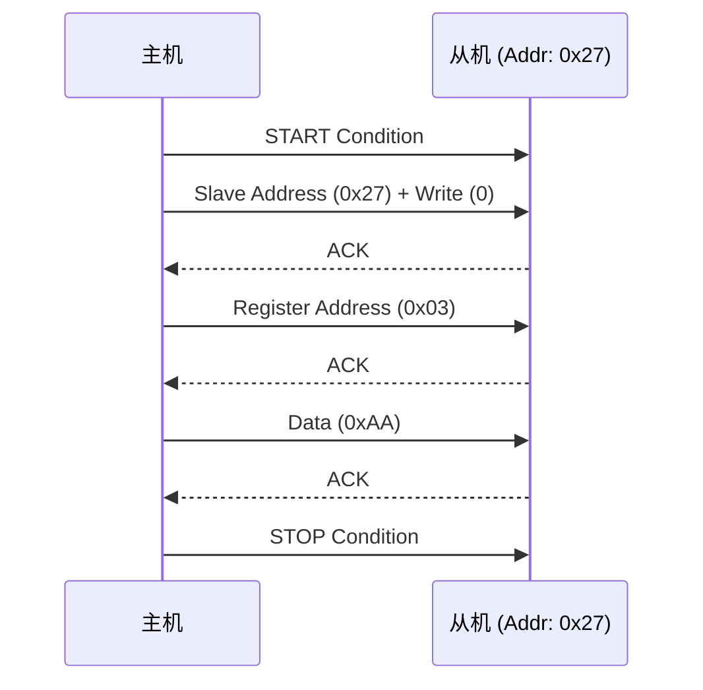
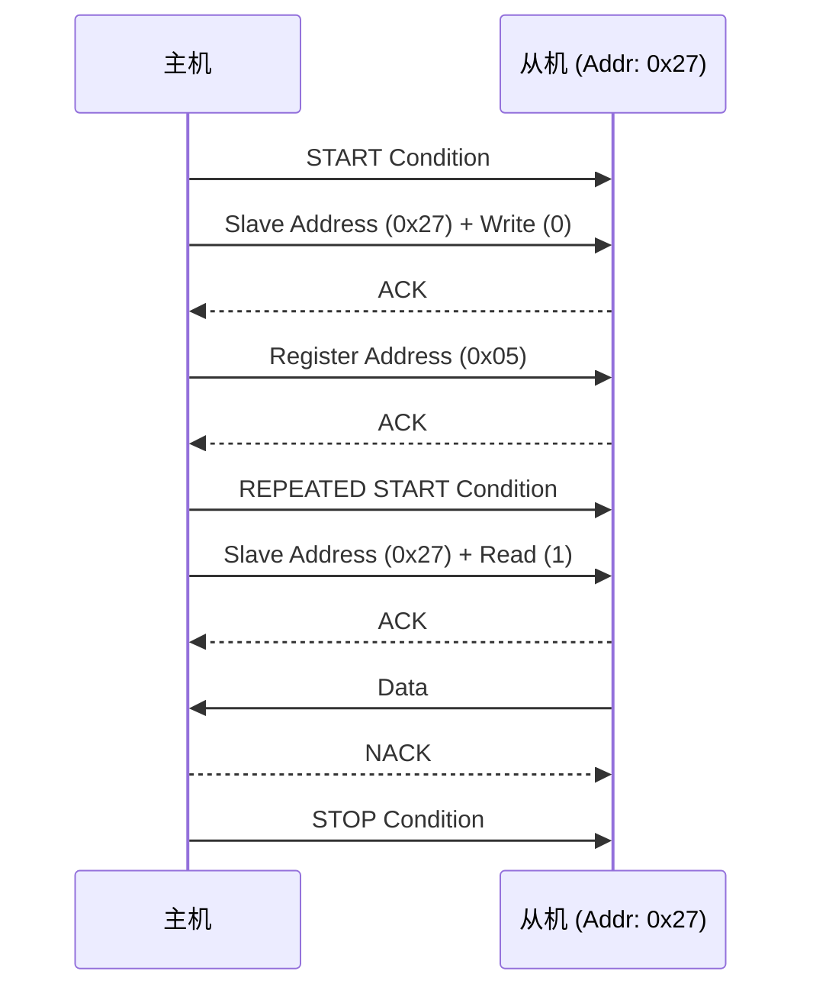
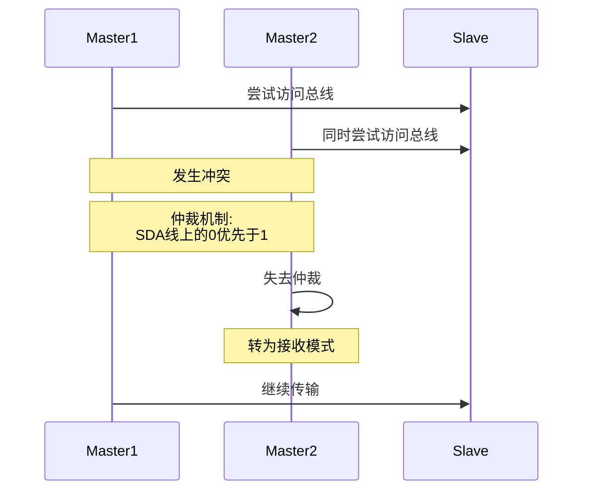
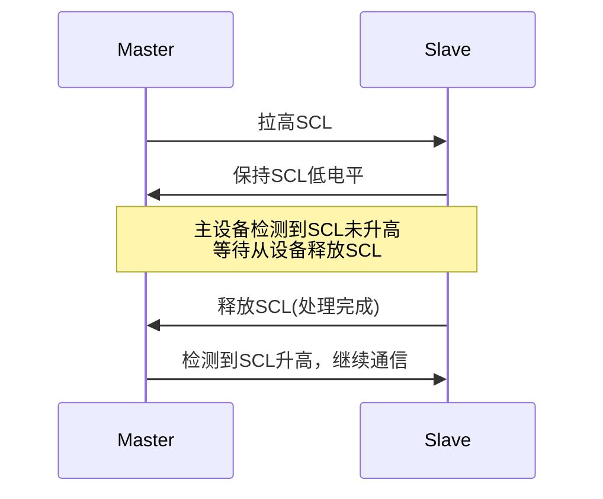

在嵌入式系统的世界里，微控制器与各种外围设备之间的“对话”是其正常运作的基石。想象一下，你的智能手环需要读取心率传感器的脉搏数据，你的智能家居中枢要控制LED灯的亮度，或者你的工业控制器需要从EEPROM中加载配置参数……这些看似简单的功能背后，都离不开一套高效、可靠的通信机制。而在这众多通信协议中，I²C（Inter-Integrated Circuit）无疑是出镜率最高的“明星”之一。

它诞生于上世纪80年代初，由飞利浦（现在的恩智浦NXP）为解决微控制器与外围芯片之间繁琐的连接问题而设计。仅仅两根线——SCL（时钟线）和SDA（数据线），就能实现多设备间的双向通信，这在当时简直是“黑科技”般的存在！

那么你是否想过，为什么I²C只需要两根线就能“统领”上百个设备？为什么上拉电阻的阻值大小能决定通信的生死？让我们一起从底层原理出发，逐层剖析。

### **1 核心原理**
#### **1.1 物理层：两根线的“玄机”**

任何上层协议的优雅，都离不开底层物理的坚实支撑。I²C的许多“怪癖”，根源都在其独特的物理层设计。

物理连接图解:

I²C总线仅由两根信号线组成：

*   **SCL (Serial Clock Line):** 时钟线，由主设备产生，用于同步数据传输。
*   **SDA (Serial Data Line):** 数据线，用于传输数据。

这两条线都是 **双向** 的，并且采用 **开漏（Open-Drain）** 或 **开集（Open-Collector）** 输出。这意味着任何设备都只能将信号线拉低到GND，但不能主动输出高电平。为了使信号线能呈现高电平，SCL和SDA线路上都必须连接一个 **上拉电阻（Pull-up Resistor）** 到VCC。

**为什么必须使用上拉电阻？**
这是I²C实现“总线仲裁”和“时钟同步”等关键特性的物理基础。
*   **线与（Wired-AND）逻辑：** 当多个设备同时连接到总线上时，只要有一个设备将线路拉低，整个线路就呈现低电平。只有当所有设备都“释放”线路（即高阻态）时，线路才会在上拉电阻的作用下恢复到高电平。
*   **多主控仲裁：** 如果两个主设备同时试图控制总线并发送数据，它们会监测SDA线。当一个主设备发送高电平（释放总线）而另一个发送低电平（拉低总线）时，发送高电平的主设备会检测到SDA线与自己发送的电平不符，便会知道总线上存在冲突，并立即放弃对总线的控制，从而保证了数据传输的完整性。

#### **1.2 协议层：通信的“规矩”与“礼仪”**

光有物理连接还不够，设备之间还需要一套共同的“语言”和“规矩”才能有效沟通。这就是I²C的协议层。

I²C通信的基本单位是 **消息（Message）**。一次完整的消息包含一个或多个 **帧（Frame）**，并由特定的信号序列来界定其开始和结束。

*   **起始条件 (START - S):** 当SCL保持 **高电平** 期间，SDA从 **高电平** 跳变为 **低电平**。只有主设备才能产生起始条件。
*   **停止条件 (STOP - P):** 当SCL保持 **高电平** 期间，SDA从 **低电平** 跳变为 **高电平**。同样，只有主设备才能产生停止条件。
*   **数据有效性:** I²C对数据传输的时序有严格规定。在SCL为 **高电平** 期间，SDA上的数据必须保持稳定，不能有任何变化。SDA的电平变化（即数据位的翻转）只能在SCL为 **低电平** 时进行。这就像在红灯亮时（SCL高）不能变道（SDA变化），只能在绿灯亮时（SCL低）才能变道。
*   **应答 (ACK) 与非应答 (NACK):** 这是I²C通信中的“确认”与“拒绝”机制。
    *   **ACK (Acknowledge):** 发送方每发送8位（一个字节）数据后，接收方会在第9个时钟周期将SDA线拉低，表示“我收到了，请继续！”。
    *   **NACK (Not Acknowledge):** 接收方在第9个时钟周期保持SDA线为高电平，表示“我没收到”、“我忙着呢”、“数据不对劲”或者“我读完了，不用再发了”。这个NACK信号在主机读数据时尤为重要，它告诉从机“我不要更多数据了”。

**数据传输帧结构:**

一次I²C通信，数据都是以8位（一个字节）为单位传输的。一个典型的数据帧包含：

1.  **从设备地址帧 (Slave Address Frame):** 这是通信的第一步，主设备要告诉总线上的所有从设备，它想和谁“说话”。这个地址可以是7位或10位（10位地址不常用）。地址后面紧跟着一位读写控制位（R/W）：`0`表示主设备要向从设备写入数据，`1`表示主设备要从从设备读取数据。
2.  **数据帧 (Data Frame):** 紧随地址帧之后，就是真正的数据了。每个数据字节后面都会跟着一个ACK/NACK位。

> 7位寻址格式:
> [6:0] - 7位设备地址
> [0] - 读(1)/写(0)位
> 
> 
> 10位寻址格式:
> 第一字节: 11110XX + R/W (XX是10位地址的高两位)
> 第二字节: 10位地址的低8位

### **2 I²C 完整通信过程**

理解了物理层和协议层，我们就可以开始“对话”了。I²C通信主要分为两种基本模式：主机写操作和主机读操作。

#### **2.1 主机写操作 (Master Write)**

这是最常见的操作，主机向从设备发送数据，比如设置传感器的工作模式，或者向EEPROM写入配置参数。

**场景：** 主机向一个传感器（假设其I²C地址为`0x27`）的内部寄存器`0x03`写入数据`0xAA`。

**过程分解：**

1.  **START:** 主机首先在SCL高电平期间，将SDA从高拉低，发出“通信开始”的信号。
2.  **Address + W:** 主机紧接着发送8位数据：前7位是从设备的地址`0x27`，最后1位是写操作标志`0`。总线上的所有从设备都会“竖起耳朵”监听，只有地址匹配的从设备才会“应答”。
3.  **ACK:** `0x27`号从设备收到地址后，在第9个SCL周期将SDA拉低，回应一个ACK，表示“收到，我是`0x27`，准备好了！”。
4.  **Register Address:** 主机继续发送一个字节`0x03`，这是要操作的从设备内部寄存器的地址。
5.  **ACK:** 从机再次回应ACK，确认收到寄存器地址。
6.  **Data:** 主机发送真正的数据`0xAA`。
7.  **ACK:** 从机再次回应ACK，确认收到数据。
8.  **STOP:** 主机在SCL高电平期间，将SDA从低拉高，发出“通信结束”的信号，释放总线。

整个过程就像一次“点对点”的快递服务：主机（发件人）先叫号（START），然后喊收件人名字（从机地址+写），收件人回应“到！”（ACK），发件人再告诉收件人包裹放哪（寄存器地址），收件人再次确认（ACK），最后发件人把包裹递过去（数据），收件人签收（ACK），交易完成（STOP）。

#### **2.2 主机读操作 (Master Read)**

主机从从设备读取数据，比如读取传感器的测量值，或者从EEPROM中读取存储的数据。

**场景：** 主机从一个传感器（地址`0x27`）的内部寄存器`0x05`读取一个字节的数据。

**过程分解：**

主机读操作通常分为两个阶段：

1.  **写阶段（设置寄存器指针）：**
    *   **START:** 主机发起通信。
    *   **Address + W:** 主机发送从机地址`0x27`和写标志位`0`。
    *   **ACK:** 从机应答。
    *   **Register Address:** 主机发送要读取的寄存器地址`0x05`。
    *   **ACK:** 从机应答。
    *   **注意：** 在这个阶段，主机不会发送STOP信号！这是为了保持总线控制权，为接下来的读操作做准备。

2.  **读阶段（获取数据）：**
    *   **REPEATED START (重复起始条件):** 这是读操作的精髓！在不发送STOP信号的情况下，主机再次发送一个START信号。这个操作非常关键，它允许主机在不释放总线的情况下，改变数据传输方向（从写变为读）。
    *   **Address + R:** 主机再次发送从机地址`0x27`，但这次带的是读标志位`1`。
    *   **ACK:** 从机应答，表示“收到读请求，数据已准备好！”。
    *   **Data:** 此时，角色互换！从机开始向主机发送数据。
    *   **NACK:** 主机在接收完最后一个字节后，不会回应ACK，而是发送一个NACK信号。这个NACK信号非常重要，它告诉从机“我已读完，不需要更多数据了，你可以停止发送了！”。
    *   **STOP:** 主机结束通信，释放总线。

读操作就像你去图书馆借书：你先告诉管理员你要哪本书（写阶段：从机地址+写+书的编号），管理员确认后（ACK），你再告诉管理员你要借（重复起始+从机地址+读），管理员把书递给你（从机发送数据），你拿到书后说“谢谢，不用了”（NACK），然后离开（STOP）。

### **3 I²C高级功能与应用场景**
#### **3.1 多主机仲裁**

I²C支持多主机，通过时钟同步和仲裁机制解决冲突：

#### **3.2 时钟延展(Clock Stretching)**

从设备可通过保持SCL为低电平延长传输周期，实现速率匹配：

### **4 常见问题与调试技巧**

I²C虽然简单，但在实际开发中，也常常会遇到一些“磨人的小妖精”。掌握这些常见问题和调试技巧，能让你少走很多弯路。

1.  **上拉电阻问题:**
    *   **阻值过大:** 如果上拉电阻阻值过大，SCL和SDA线从低电平恢复到高电平的时间会变长（RC充电时间常数）。在高波特率（比如400kHz甚至1MHz）下，这可能导致信号上升沿缓慢，违反I²C的时序要求，从而导致通信失败或数据错误。
    *   **阻值过小:** 如果上拉电阻阻值过小，当设备将线路拉低时，流过上拉电阻的电流会过大。这可能超过设备I/O引脚的灌电流能力，甚至可能损坏设备。
    *   **选型:** 上拉电阻的阻值通常在1kΩ到10kΩ之间。具体选择多少，取决于总线电容（连接的设备数量、PCB走线长度）、工作电压和通信速率。一般来说，速率越高，总线电容越大，上拉电阻就需要越小。经验法则是先从4.7kΩ或2.2kΩ开始尝试。
2.  **地址错误:** 这是最常见的错误之一。
    *   **7位 vs 8位地址:** 很多数据手册提供的是7位从机地址，但有些I²C驱动或库函数要求你传入8位地址（即7位地址左移1位，并包含读写位）。务必仔细阅读数据手册和驱动文档，确认传入的地址格式是否正确。
    *   **地址冲突:** 如果总线上有两个从设备使用了相同的地址，那么通信就会混乱。
    *   **设备未上电/未初始化:** 从设备没有正确上电或没有完成初始化，自然不会响应I²C地址。
3.  **ACK/NACK问题:** 传输中途出现NACK，通常意味着从机没有正确响应。
    *   **原因:** 可能是地址错误（从机根本没收到地址）、从机正忙（内部操作未完成）、从机未正常工作（硬件故障）、或者数据格式不正确导致从机无法解析。
    *   **调试:** 使用逻辑分析仪查看NACK发生在哪个字节之后，这能帮助你定位问题。
4.  **总线被锁死:** 这是I²C的“僵尸模式”。当某个设备在I²C传输过程中突然复位、掉电或出现异常，它可能将SDA线永久拉低，导致整个I²C总线被“锁死”，任何通信都无法进行。
    *   **解决方法:** 主机可以尝试发送9个时钟脉冲（在SCL线上产生9个时钟周期，但不关心SDA），让从机完成当前字节传输并释放SDA线。如果SDA线仍然被拉低，则可能需要复位从设备或整个系统。有些I²C控制器有硬件复位总线的功能。
5.  **逻辑分析仪:** 调试I²C问题的“上帝视角”！如果你在I²C通信上遇到了“玄学”问题，一个逻辑分析仪（哪怕是几十块钱的USB逻辑分析仪）都能帮你“拨云见日”。它能清晰地捕获SCL和SDA上的波形，并自动解析出START/STOP、地址、数据和ACK/NACK，让你一目了然地看到通信的每一个细节，是定位时序问题、数据错误、ACK/NACK异常的终极神器。但是必要的时候（上升下降时间、波形电平）还是需要使用示波器进行波形抓取。

### **5 I²C协议标准与规范**

I²C协议已被标准化，主要规范包括：

1. **[NXP I²C规范](https://www.nxp.com/docs/en/user-guide/UM10204.pdf)**: UM10204, 定义基本特性和操作方法
2. **[SMBus规范](http://smbus.org/specs/)**: 系统管理总线(I²C派生)规范
3. **[PMBus规范](https://pmbusprod.wpenginepowered.com/wp-content/uploads/2023/07/PMBus-Specification-Rev-1-4-1-Part-III-20220418.pdf)**: 电源管理总线(SMBus派生)规范

### **总结**

**优点：**
- **接线少:** 仅需2根线（SCL, SDA），大大节省了微控制器的I/O资源和PCB布线空间，降低了硬件成本和设计复杂度。 
 - **多设备:** 支持在同一总线上挂载多个主设备和多个从设备，扩展性强，非常适合连接多个传感器、存储器等外设。 
 - **灵活性:** 协议相对简单，易于在软件（位操作）或硬件（I²C外设）中实现。 
 - **标准化:** 广泛的行业支持和海量的兼容设备，生态系统成熟，选择丰富。

**缺点：**
- **速度受限:** 相较于SPI（串行外设接口）等协议，I²C的速度较慢。常见的标准模式为100kbps，快速模式为400kbps，高速模式可达3.4Mbps，但仍不如SPI快。对于需要高速数据传输的应用（如显示屏），I²C可能不是最佳选择。 
 - **距离受限:** 由于总线电容效应，I²C的通信距离有限，通常仅限于同一块PCB板内或短距离连接。长距离传输需要额外的总线缓冲器或转换芯片。 
 - **协议开销:** 每个字节的数据传输都需要一个额外的ACK/NACK位，这增加了协议的开销。在传输大量小数据包时，效率会受到一定影响。 
 - **总线锁死风险:** 存在总线被从设备异常行为锁死的风险，需要额外的软件或硬件机制来处理。

**设计建议**
1. **布线考虑**:
    - 尽量保持SCL和SDA走线平行、等长
    - 避免与高速信号或电源走线并行
    - 加入适当的去耦电容

2. **电气参数**:
    - 根据总线长度和设备数量选择合适的上拉电阻
    - 考虑总线电容对上升时间的影响

3. **软件实现**:
    - 使用状态机处理I²C通信流程
    - 实现超时机制防止死锁
    - 增加重试机制提高鲁棒性

**性能优化**
1. **速率选择**:
    - 根据实际需求选择合适的速率模式
    - 考虑线路电容限制

2. **传输效率**:
    - 批量读写代替单字节操作
    - 使用页写入模式优化EEPROM等设备的写入性能

3. **中断与DMA**:
    - 利用MCU的I²C中断/DMA功能提高效率
    - 实现非阻塞通信

### **常见问题解答 (FAQ)**

1.  **Q: I²C支持多主控吗？如何实现仲裁？**
    **A:** I²C支持多主控。当多个主设备同时尝试控制总线时，I²C通过“时钟同步”和“数据仲裁”机制来解决冲突。
    *   **时钟同步：** 多个主设备会同步它们的SCL信号，只要有一个主设备拉低SCL，SCL就保持低电平。
    *   **数据仲裁：** 这是关键。当一个主设备发送高电平（释放SDA）而另一个主设备发送低电平（拉低SDA）时，发送高电平的主设备会检测到SDA线与自己发送的电平不符。它会立即意识到总线冲突，并主动放弃对总线的控制，进入监听模式。这种“谁先拉低谁赢”的机制保证了数据传输的完整性。

2.  **Q: 如何为我的I2C总线选择合适的上拉电阻值？**
    **A:** 这是一个权衡。**阻值太大**，拉高电流小，信号上升时间长，高速率下会出问题；**阻值太小**，灌电流大，可能超出GPIO引脚的承受能力，且功耗增加。一个经验法则是：对于100kbps速率，使用4.7kΩ；对于400kbps速率，使用1.8kΩ到2.2kΩ。最科学的方法是根据总线电容、电压和速率，查阅I2C官方规范（UM10204）中的公式进行计算。

3.  **Q: 为什么I²C总线会被锁死？如何避免和解决？**
    **A:** I²C总线锁死通常发生在从设备在通信过程中异常复位、掉电或程序跑飞，导致SDA线被永久拉低。因为I²C是线与逻辑，SDA被拉低后，总线就无法恢复高电平，所有通信都会停止。
     1. 确保从设备的电源稳定，软件逻辑健壮，避免死循环或异常中断。
     2.  **软件复位：** 主机尝试发送9个时钟脉冲（在SCL上产生9个时钟，不关心SDA），让从机有机会释放SDA。
     3.  **硬件复位：** 如果软件复位无效，可能需要通过控制从设备的复位引脚来强制复位从设备。
     4.  **总线复位：** 某些I²C控制器有硬件总线复位功能，可以直接复位I²C总线状态。
     5.  **电源复位：** 最“暴力”但有效的方法是给从设备断电再上电。

4.  **Q: 我的从设备总是返回NACK，最快的排查步骤是什么？**
    **A:** 遵循“由硬到软”原则：
    1.  **测电压：** 确认从设备VCC和GND都已正确连接。
    2.  **查上拉：** 确认SCL和SDA上拉电阻存在且阻值合适。
    3.  **核对地址：** 用`i2cdetect`或逻辑分析仪确认你代码中的地址和设备实际地址是否一致（注意7位/8位格式）。
    4.  **简化总线：** 只保留一个主机和一个从机，排除其他设备的干扰。
    5.  **检查时序：** 用逻辑分析仪检查你的START信号、时钟频率和时序是否符合规范。

5.  **Q: 什么是“时钟拉伸”（Clock Stretching），它有什么用？**
    **A:** “时钟拉伸”是I2C协议中一个非常重要的特性。它允许从设备在需要更多时间处理数据时（比如正在进行一次内部ADC转换），主动将SCL线拉低，从而“暂停”时钟。主机检测到SCL被拉低后，会耐心等待，直到从机处理完任务并释放SCL线，通信才会继续。这赋予了从设备一定的主动权，确保了在主快从慢的情况下数据不会丢失，大大增强了系统的健壮性。

### 参考资料

[1]: [NXP I²C-bus specification and user manual (UM10204)](https://www.nxp.com/docs/en/user-guide/UM10204.pdf)
[2]: [System Management Bus (SMBus) Specification](http://smbus.org/specs/)
[3]: [I²C-bus Design and Implementation (Texas Instruments)](https://www.ti.com/lit/an/slva689/slva689.pdf)
[4]: [STM32 I²C Peripheral Application Note (AN2824)](https://www.st.com/resource/en/application_note/cd00209826-i2c-protocol-used-in-the-stm32-bootloader-stmicroelectronics.pdf)
[5]:[PMBus Specification](https://pmbusprod.wpenginepowered.com/wp-content/uploads/2023/07/PMBus-Specification-Rev-1-4-1-Part-III-20220418.pdf)

