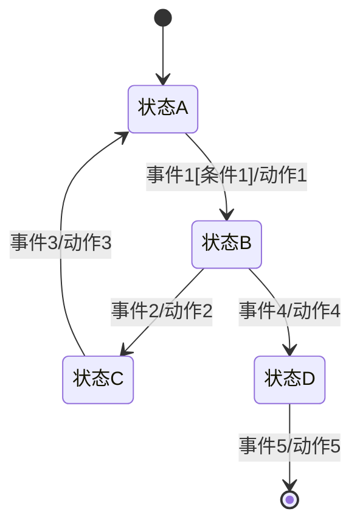
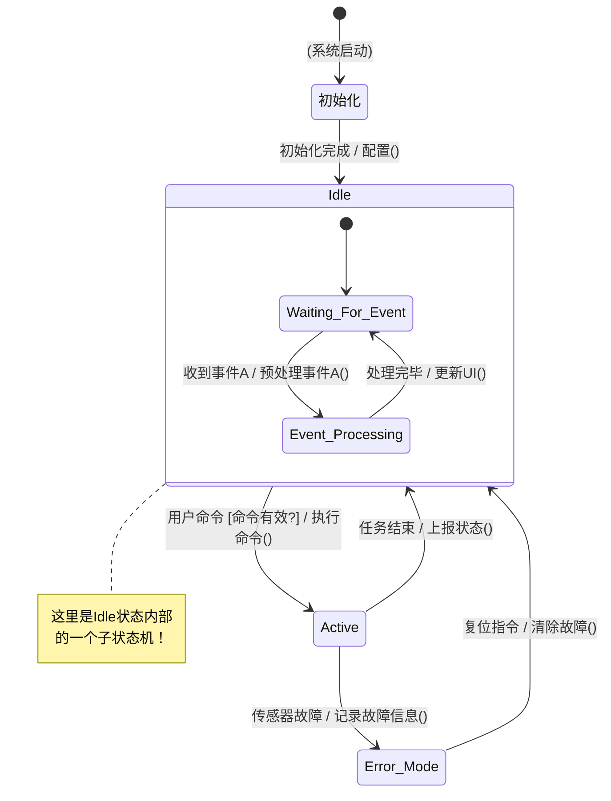
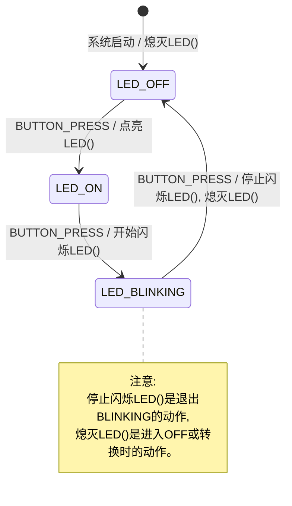

你是不是也遇到过这样的场景：项目需求一变再变，代码里的 `if-else` 嵌套得跟俄罗斯套娃似的，牵一发动全身，改一个 bug 引发三个新 bug？有没有一种优雅的方式来驯服这种复杂性？答案肯定是有，他就是**状态机（Finite State Machine，简称 FSM）**！这玩意儿，用好了，代码瞬间优雅好几个level！

### **啥是状态机？**

想象一下你家里的洗衣机：
*   你插上电源，它处于“待机”**状态**。
*   你按了“启动”按钮（这是一个**事件**），洗衣机**转换**到“进水”状态，并开始**动作**（打开进水阀）。
*   水位到了，又一个内部**事件**触发，它**转换**到“洗涤”状态，电机开始转动（另一个**动作**）。
*   ……最后进入“甩干”、“完成”等状态。

这就是一个状态机！用一句话概括来说：它规定了“在什么状态，遇到什么事，该干什么活，然后去哪个状态”。所以，状态机本质上是一种**行为建模工具**，它用一种结构化的方式来描述一个对象或系统在其生命周期内响应事件所经历的各种状态序列。对于我们写代码的人来说，它就是梳理复杂逻辑、让代码结构更清晰的“神器”。

> 维基百科：有限状态机（FSM ）或有限状态自动机（FSA，复数：自动机）、有限自动机或简称状态机是一种计算的数学模型。它是一种抽象的机器模型，在任何给定时间只能处于有限个状态中的一种。FSM 可以根据某些输入从一种状态转换为另一种状态；从一种状态转换为另一种状态称为转换。FSM 由其状态列表、初始状态以及触发每次转换的输入定义。有限状态机有两种类型：确定性有限状态机和非确定性有限状态机。对于任何非确定性有限状态机，都可以构建一个等效的确定性有限状态机。

### **为何偏爱状态机？**

为啥这玩意儿这么受欢迎？因为无论是控制简单的LED闪烁，还是构建复杂的通信协议栈、用户界面逻辑（即便是在没有图形库的裸机环境下），都可以用它！

*   **逻辑清晰，一眼看穿：** 状态图一画出来，系统的行为逻辑就像导航地图一样清晰，再也不怕在 `if-else` 的迷宫里绕不出来了。
*   **维护方便，改bug不慌：** 需求变了？或者要修个bug？对着状态图改，比大海捞针找那堆交错的代码强太多了！模块化，懂的都懂。
*   **化繁为简，轻松驾驭：** 再复杂的逻辑，也能被分解成一个个独立的状态和明确的转换，大事化小，小事化了。
*   **行为可预测，系统更稳：** 在某个状态下，发生某个事件，下一个状态是确定的。
*   **测试方便，效率翻倍：** 每个状态、每个转换都能单独拎出来测试，测试覆盖率蹭蹭往上涨，质量有保障！

### **状态机的核心组件有哪些？**

*   **状态 (State):** 系统在其生命周期中稳定存在的特定模式或情况。比如，咖啡机可以有“待机”、“加热”、“冲泡”、“清洁”等状态。
*   **初始状态 (Initial State):** 状态机上电或复位后进入的第一个“大本营”。
*   **事件 (Event/Trigger):** 内部或外部的“信号弹”，能触发状态的迁移。例如：按键按下、定时器超时、传感器数据超限、收到网络消息。
*   **转换 (Transition):** 从一个状态指向另一个状态的“有向路径”，由特定事件触发。
*   **动作 (Action):** 在转换发生时、进入状态时或退出状态时执行的“任务列表”。可以是打开一个LED、启动一个电机、发送一条数据等。
    *   **进入动作 (Entry Action):** 刚进入某个状态时立刻执行。
    *   **退出动作 (Exit Action):** 离开某个状态前执行。
    *   **转换动作 (Transition Action):** 在状态转换的途中执行。
*   **守卫条件 (Guard Condition):** 一个布尔“通行证”。事件发生了，但只有当这个条件为真（比如 `is_battery_low == false`），对应的转换才能“放行”。

用一个通用的状态机模型来直观感受下：


*状态（圆角矩形）、初始和结束标记（实心圆）、事件、守卫条件（方括号内）以及动作（斜杠后）。*

### **怎样设计状态机**

设计一个状态机通常遵循以下步骤：

1.  **识别状态 (Identify States):**
    *   思考系统所有可能的、有意义的、稳定的操作模式或条件。
    *   为每个状态赋予一个清晰、描述性的名称（例如：`初始化中`、`等待指令`、`数据采集`、`低功耗休眠`）。
    *   确定初始状态和可能的最终状态（如果存在）。

2.  **识别事件 (Identify Events):**
    *   列出所有可能影响系统状态的内部和外部事件。
    *   例如：`按键按下`、`串口收到新数据`、`定时器中断`、`电池电量低报警`。

3.  **定义转换 (Define Transitions):**
    *   对于每个状态，确定哪些事件会使其转换到另一个状态。
    *   明确转换的源状态、目标状态和触发事件。
    *   考虑是否有守卫条件限制转换的发生。

4.  **定义动作 (Define Actions):**
    *   确定在进入状态、退出状态或进行转换时需要执行哪些操作。
    *   例如：启动定时器、发送消息、更新变量、控制硬件（如点亮LED、启动电机）。

5.  **绘制状态图 (Draw State Diagram):**
    *   使用图形化表示法（如UML状态图）将状态、事件、转换和动作可视化。这是理解和沟通设计的关键步骤。
    *   **UML状态图** 是一个非常强大且标准化的工具，支持嵌套状态（分层状态机）、并发区域、历史状态等高级特性。



*这是一个简化的UML风格状态图示例，展示了基本转换、动作、守卫条件和嵌套状态的概念。*

6.  **评审和迭代 (Review and Iterate):**
    *   与团队成员一起评审状态图和设计。
    *   检查是否有遗漏的状态、事件或转换。
    *   确保逻辑的完整性和正确性。
    *   模拟执行流程，走查各种场景。

### **代码怎么写？**

1.  **经典的 `switch-case`大法:**
    *   简单直接，小巧玲珑的状态机首选。用一个枚举定义状态，一个变量保存当前状态，主循环或任务函数里一个大 `switch` 根据当前状态执行逻辑，`case` 内部用 `if-else if` 处理事件。

	```c
	// 定义状态和事件
	typedef enum { 
	    STATE_IDLE, 
	    STATE_RUNNING, 
	    STATE_ERROR 
	} SystemState_t;
	
	typedef enum {
	    EV_NONE,
	    EV_START_PRESSED,
	    EV_STOP_PRESSED,
	    EV_FAULT_DETECTED
	} SystemEvent_t;
	
	SystemState_t g_currentState = STATE_IDLE; // 全局变量存当前状态
	
	// 状态机处理函数
	void state_machine_handler(SystemEvent_t event) 
	{
	    printf("当前状态: %d, 收到事件: %d\n", g_currentState, event);
	
	    switch (g_currentState) 
	    {
	    case STATE_IDLE:
	        if (event == EV_START_PRESSED) 
	        {
	            printf("动作: 从IDLE切换到RUNNING\n");
	            g_currentState = STATE_RUNNING;
	        }
	        // IDLE状态下还可以处理其他事件...
	        break;
	
	    case STATE_RUNNING:
	        if (event == EV_STOP_PRESSED) 
	        {
	            printf("动作: 从RUNNING切换到IDLE\n");
	            g_currentState = STATE_IDLE;
	        } 
	        else if (event == EV_FAULT_DETECTED) 
	        {
	            printf("动作: 发生故障！切换到ERROR状态\n");
	            g_currentState = STATE_ERROR;
	        }
	        break;
	
	    case STATE_ERROR:
	        if (event == EV_STOP_PRESSED) 
	        { 
	            printf("动作: 从ERROR状态恢复到IDLE\n");
	            g_currentState = STATE_IDLE;
	        }
	        break;
	
	    default:
	        // 一般不应该到这里，以防万一
	        g_currentState = STATE_ERROR;
	        break;
	    }
	}
	```

2.  **状态表/函数指针大法:**
    *   当状态和事件一多，`switch-case` 就显得臃肿了。这时候，用函数指针数组（或者叫状态表）就更香了！每个状态对应一个处理函数，或者用一个二维表（状态 x 事件 -> 下一状态 + 动作函数）。代码结构更清晰，扩展性也更好。

	```c
	void handle_state_idle(SystemEvent_t event);
	void handle_state_running(SystemEvent_t event);
	void handle_state_error(SystemEvent_t event);
	
	
	void (*state_handlers[])(SystemEvent_t) = {
	    handle_state_idle,
	    handle_state_running,
	    handle_state_error
	};
	
	
	void state_machine_handler(SystemEvent_t event) 
	{
	    if (event != EV_NONE) 
	    {
	        state_handlers[g_currentState](event);
	    }
	}
	
	void handle_state_idle(SystemEvent_t event) 
	{
	    if (event == EV_START_PRESSED) 
	    {
	        printf("动作: 从IDLE切换到RUNNING\n");
	        g_currentState = STATE_RUNNING;
	    }
	    // IDLE状态下还可以处理其他事件...
	}
	
	void handle_state_running(SystemEvent_t event) 
	{
	    if (event == EV_STOP_PRESSED) 
	    {
	        printf("动作: 从RUNNING切换到IDLE\n");
	        g_currentState = STATE_IDLE;
	    } 
	    else if (event == EV_FAULT_DETECTED) 
	    {
	        printf("动作: 发生故障！切换到ERROR状态\n");
	        g_currentState = STATE_ERROR;
	    }
	}
	
	void handle_state_error(SystemEvent_t event) 
	{
	    if (event == EV_STOP_PRESSED) 
	    { 
	        printf("动作: 从ERROR状态恢复到IDLE\n");
	        g_currentState = STATE_IDLE;
	    }
	}
	```

3.  **C++的面向对象之道:**
	*   如果使用C++，可以利用类和虚函数（状态模式 State Pattern）来实现状态机。
    *   每个状态是一个类，实现一个共同的接口（例如 `handle_event()`）。
    *   上下文类持有一个指向当前状态对象的指针。

4.  **使用状态机库或框架:**
- **QP/C™ 和 QP-nano™**: Miro Samek 出品的轻量级实时嵌入式框架 (Quantum Leaps)，原生支持UML状态图的层次化状态机。
- **SMC (State Machine Compiler)**: 一个能从特定描述语言生成多种语言（包括C/C++）状态机代码的工具。
- **Boost.Statechart / Boost.MSM (Meta State Machine)**: C++模板库，功能强大，但对编译器的要求较高，更适合C++项目。
- **Matlab Stateflow®**: 强大的图形化建模和仿真环境，可以生成高效的C/C++代码，广泛应用于汽车电子、航空航天等领域。

### **用状态机点亮一个LED能有多复杂？**

*   **需求:** 一个LED灯，初始灭。按一下按钮，灯亮。再按一下，灯闪烁。再按一下，灯灭。循环往复。
*   **状态:** `LED_OFF` (灯灭), `LED_ON` (灯亮), `LED_BLINKING` (灯闪烁)
*   **事件:** `BUTTON_PRESS` (按钮按下)
*   **动作:** `熄灭LED()`, `点亮LED()`, `开始闪烁LED()`, `停止闪烁LED()`



```c
#include <stdio.h>

// --- 硬件抽象层 ---
void hw_turn_led_off() 
{ 
    printf("硬件操作: LED灭了！\n"); 
}
void hw_turn_led_on() 
{ 
    printf("硬件操作: LED亮了！\n"); 
}
void hw_start_led_blinking() 
{ 
    printf("硬件操作: LED开始闪啊闪！\n"); /* 这里通常会启动一个定时器来控制闪烁 */ 
}
void hw_stop_led_blinking() 
{ 
    printf("硬件操作: LED停止闪烁了。\n"); /* 停止定时器 */ 
}

// --- 状态机核心定义 ---
typedef enum {
    FSM_LED_STATE_OFF,
    FSM_LED_STATE_ON,
    FSM_LED_STATE_BLINKING
} LedFsmState_t;

typedef enum {
    FSM_LED_EV_NONE,
    FSM_LED_EV_BUTTON_PRESSED // 按下按钮！
} LedFsmEvent_t;

static LedFsmState_t s_ledCurrentState = FSM_LED_STATE_OFF; // 用static把状态藏起来，更安全

// --- 状态机核心函数 ---
// 初始化状态机
void led_fsm_init() 
{
    s_ledCurrentState = FSM_LED_STATE_OFF;
    hw_turn_led_off(); // 初始化，把LED搞灭
    printf("LED状态机: 初始化完成，当前状态 LED_OFF (灭)\n");
}

// 状态机事件处理函数 - 你可以在主循环调用它，或者在中断里设置事件标志，主循环处理
void led_fsm_handle_event(LedFsmEvent_t event) 
{
    if (event == FSM_LED_EV_NONE && s_ledCurrentState != FSM_LED_STATE_BLINKING) {
        return; // 如果没事件，并且不是闪烁状态（闪烁状态内部可能有自己的定时逻辑），就歇着
    }

    // 闪烁状态的特殊处理，通常由定时器中断驱动更新LED，这里简单示意
    if (s_ledCurrentState == FSM_LED_STATE_BLINKING && event == FSM_LED_EV_NONE) {
        printf("LED状态机: 我在闪烁中...\n"); // 模拟闪烁的周期性动作
        return;
    }


    printf("LED状态机: 收到事件 BUTTON_PRESS (按钮按下), 当前状态是: ");
    switch(s_ledCurrentState) 
    {
        case FSM_LED_STATE_OFF: printf("LED_OFF (灭)\n"); break;
        case FSM_LED_STATE_ON: printf("LED_ON (亮)\n"); break;
        case FSM_LED_STATE_BLINKING: printf("LED_BLINKING (闪烁)\n"); break;
    }


    switch (s_ledCurrentState) 
    {
        case FSM_LED_STATE_OFF:
            if (event == FSM_LED_EV_BUTTON_PRESSED) 
            {
                hw_turn_led_on(); // 动作！
                s_ledCurrentState = FSM_LED_STATE_ON; // 切换状态！
                printf("LED状态机: 状态切换 -> LED_ON (亮)\n");
            }
            break;

        case FSM_LED_STATE_ON:
            if (event == FSM_LED_EV_BUTTON_PRESSED) 
            {
                hw_start_led_blinking(); // 动作！
                s_ledCurrentState = FSM_LED_STATE_BLINKING; // 切换状态！
                printf("LED状态机: 状态切换 -> LED_BLINKING (闪烁)\n");
            }
            break;

        case FSM_LED_STATE_BLINKING:
            if (event == FSM_LED_EV_BUTTON_PRESSED) 
            {
                hw_stop_led_blinking(); // 先停止闪烁（退出动作）
                hw_turn_led_off();      // 再熄灭LED（进入/转换动作）
                s_ledCurrentState = FSM_LED_STATE_OFF; // 切换状态！
                printf("LED状态机: 状态切换 -> LED_OFF (灭)\n");
            }
            break;
    }
}

// --- 模拟跑一下（实际项目里，事件来自中断或轮询） ---
int main() 
{
    led_fsm_init();

    printf("\n模拟第1次按按钮:\n");
    led_fsm_handle_event(FSM_LED_EV_BUTTON_PRESSED);
    led_fsm_handle_event(FSM_LED_EV_NONE); // 模拟一个没有事件的周期

    printf("\n模拟第2次按按钮:\n");
    led_fsm_handle_event(FSM_LED_EV_BUTTON_PRESSED);
    led_fsm_handle_event(FSM_LED_EV_NONE);

    printf("\n模拟第3次按按钮:\n");
    led_fsm_handle_event(FSM_LED_EV_BUTTON_PRESSED);
    led_fsm_handle_event(FSM_LED_EV_NONE);

    printf("\n完美！一个循环结束了！\n");
    return 0;
}
```

一个小小的LED控制，用状态机来写，逻辑是不是特别顺溜？加新功能（比如长按进入配置模式）也方便得很！

### **状态机设计的那些“坑”和“神技”**

*   **原子性操作** 尤其是在有中断、多任务的环境下，状态变量的读写、关键标志位的修改，一定要保证原子性！不然状态跳错了都不知道咋回事。可能需要临界区保护（关中断、用互斥锁/信号量、事件驱动）。
*   **错误处理要优雅：** 不光要有专门的 `ERROR` 状态，还要有明确的错误恢复机制（如超时重试、复位到安全状态、记录错误代码后重启），详细的错误日志是调试的救星。
*   **调试大法好：**
    *   **日志输出：** `printf` 大法（或者更专业的日志库）不能少，当前状态、收到的事件、要切换的下一状态，都打出来。
    *   **打桩测试：** 模拟各种事件输入，看看状态机是不是按预期跳。
*   **文档图文并茂：** 状态图就是最好的文档！但千万记得，代码改了，图也要跟着改！
*   **工具辅助设计：** 现在有很多UML建模工具（免费的如StarUML, Papyrus；商业的如Enterprise Architect；专业的如前面说的QP/C, SMC, Boost.Statechart, Matlab Stateflow等），能帮你画图，有的还能生成代码。能偷懒为啥不偷呢？
- **分层状态机:** 状态数量过多，出现所谓的“状态爆炸”，或者多个状态中有大量重复的事件处理逻辑时。可以使用分层状态机，能大大简化复杂系统的设计。比如一个“播放音乐”的大状态，里面可以有“正常播放”、“快进”、“倒带”等子状态。父状态能统一处理一些通用事件，或者把事件“下放”给当前活动的子状态。
- **正交区域:** 让你的状态机能“一心多用”，同时处于好几个并行的状态里。比如，一个设备可能同时要管理它的“网络连接状态”和它的“用户界面显示状态”。
- **事件队列:** 搞RTOS的项目里，事件通常是丢到一个队列里，状态机任务舒舒服服地从队列里拿事件来处理。这样能很好地解耦事件的产生和消耗，还能应对事件的“瞬间高峰”。

### **状态机，你值得拥有！**

关于状态机就先到这儿。希望能让你对状态机有个全新的认识。相信我，一旦你体会到它的好，就会爱上这种“一切皆在掌控”的感觉！当然始终从需求出发，选择最适合当前问题的状态机复杂度。如果一个简单的 `if-else` 就能清晰解决问题，并且未来扩展性要求不高，就没必要非得上重量级的HSM。状态机是工具，不是目的。

### **常见问题解答**

**Q1: 什么情况下应该使用简单状态机，什么情况下应该使用分层状态机？**

**A:** 选择取决于系统复杂度。简单状态机适用于状态数量少于10个且逻辑相对直接的系统。当你发现自己在多个状态中重复相同的代码，或状态数量快速增长时，应该考虑使用分层状态机。一个经验法则是：如果你的状态转换图开始变得难以在一页纸上绘制，那么分层状态机可能是更好的选择。

**Q2: 状态机和中断处理如何结合？**

**A:** 中断和状态机的结合是嵌入式系统中的常见场景。最佳实践是在中断处理函数中只做最小必要的工作：捕获数据、更新标志或向事件队列添加事件，然后在主循环中处理这些事件。避免在中断处理函数中直接调用状态机处理逻辑，因为这可能导致竞态条件。例如，在UART接收中断中，你可以将接收到的字节放入缓冲区并设置一个标志；主循环检测到这个标志后，会从缓冲区读取数据并将其传递给状态机处理。对于需要立即响应的情况，可以考虑使用事件队列和优先级机制。

**Q3: 如何处理状态机中的异常情况？**

**A:** 健壮的状态机应该能够优雅地处理异常。关键策略包括：1)为每个状态定义默认处理逻辑，处理未预期的事件；2)实现全局错误状态，作为发生严重问题时的安全港；3)在状态转换时验证前提条件，如果不满足则拒绝转换；4)记录异常事件以便日后分析；5)实现恢复机制，例如超时后自动重置或返回到已知安全状态。在工业控制器中，可以实现了一个"安全状态"，系统在检测到异常后会转入该状态，关闭所有输出并等待人工干预，这避免了潜在的危险情况。

**Q4: 状态机设计中的常见陷阱有哪些？**

**A:** 状态机实现中的常见陷阱包括：1)状态爆炸 - 尝试为每种可能的条件组合创建单独状态；2)遗漏状态转换 - 忘记处理某些事件/状态组合；3)含糊不清的状态定义 - 状态之间的边界模糊；4)过度使用全局变量导致状态逻辑混乱；5)忽略入口/出口动作，导致资源初始化或清理不一致；6)在状态处理函数中引入阻塞操作。解决这些问题的方法是：保持状态定义清晰，使用状态图可视化转换逻辑，实现完整的单元测试，以及在状态处理代码中使用断言来验证假设。

**Q5: 在RTOS环境中，如何实现状态机？**

**A:** 在RTOS环境中实现状态机有几种方法：1)任务内状态机 - 每个任务可以有自己的状态机，处理特定子系统的逻辑；2)消息驱动状态机 - 使用RTOS消息队列传递事件，一个专用任务处理状态机逻辑；3)状态机框架 - 使用像QP/C这样的框架，它与RTOS集成并提供高级状态机功能。重要的是确保状态机的线程安全，特别是当多个任务可能影响状态时。在一个复杂的嵌入式系统中，我们为每个主要子系统(UI、通信、控制)实现了独立的状态机任务，它们通过消息队列通信，这种模块化方法极大地简化了系统设计和调试。
