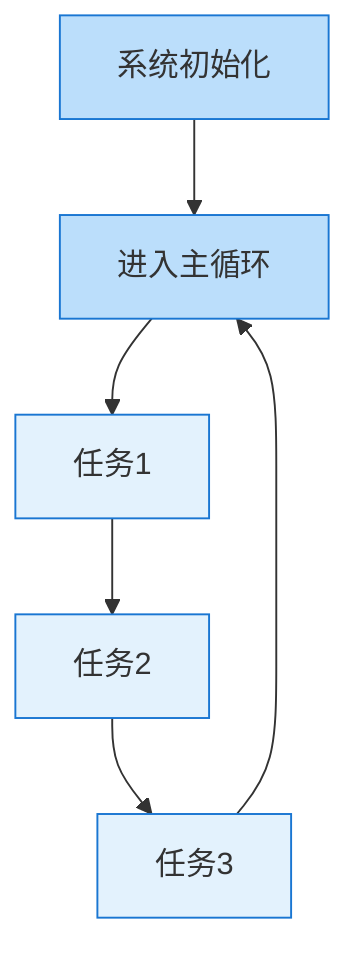
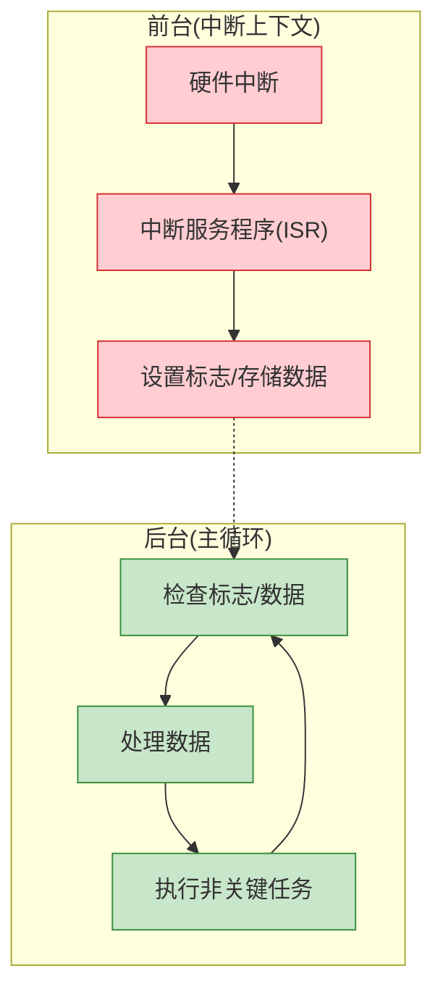
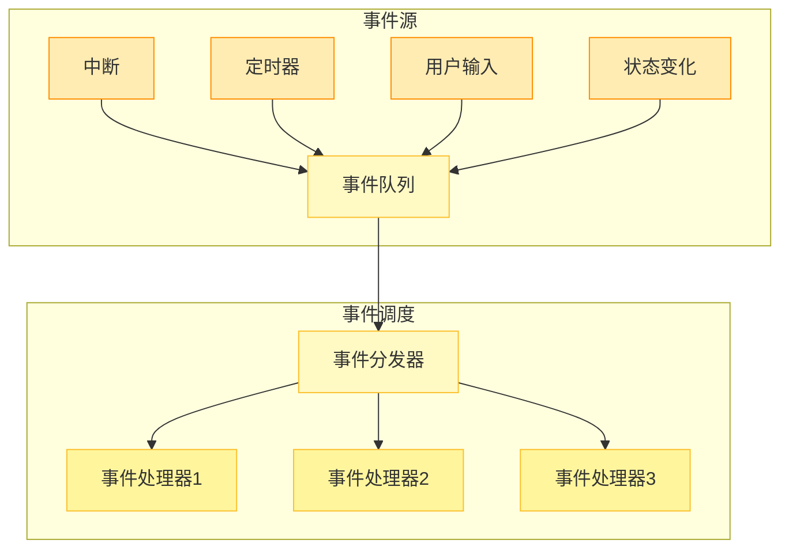
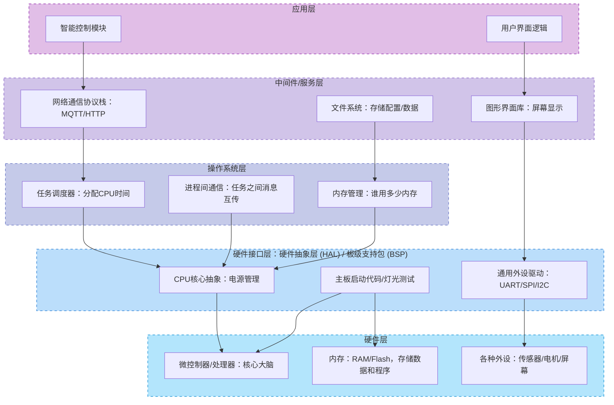
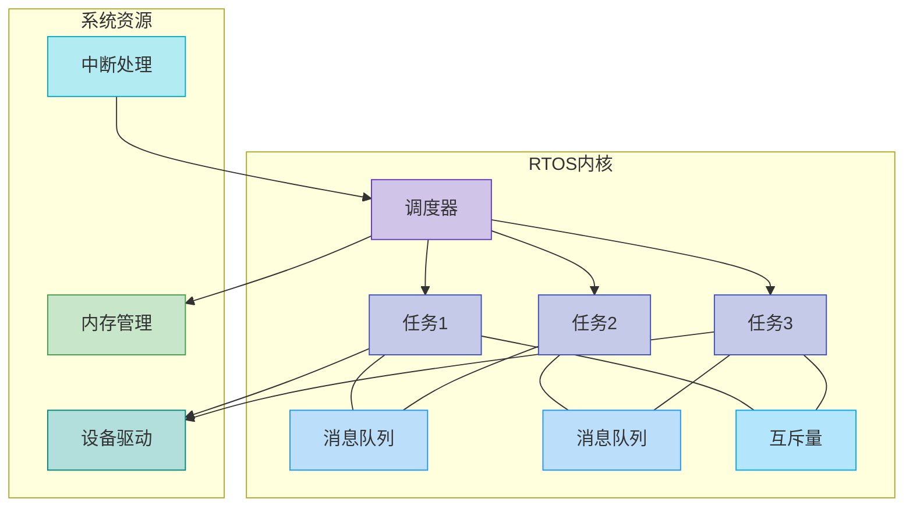

合适的架构设计对系统至关重要，它就像建筑的框架，决定了你能搭建多高、多稳的楼房。在嵌入式软件开发的世界里，是否一种架构模式能“包打天下”？咱们今天就来扒一扒。深入探索那些你耳熟能详、或者即将认识的嵌入式软件架构！

### **1. 超级循环架构**

超级循环架构可能是最简单、最直观的嵌入式软件架构。其本质上是一个顺序执行模型，其核心特点是确定性执行顺序和简单的控制流。

他的结构图看起来是这样的：



代码实现起来是这样：

```c
void main(void) {
    // 系统初始化
    SystemInit();
    PeripheralInit();
    
    // 超级循环
    while(1) {
        CheckInputs();        // 检查输入
        ProcessData();        // 处理数据
        UpdateOutputs();      // 更新输出
        HandleCommunication(); // 处理通信
        // 其他任务...
    }
}
```

这种架构主要适用于资源紧张、功能简单、对实时性要求不高的场合。给超级循环架构加上"时间片轮询"、状态机等方法也能让其更有条理，任务执行更加可控。这种架构设计时需要考虑以下几点：

1. **任务设计原则**：每个任务应当快速完成，避免阻塞式操作
2. **状态保存**：任务间共享数据需通过全局变量，注意保持数据一致性
3. **优先级控制**：通过调整任务在循环中的顺序和执行频率实现粗粒度优先级（例如，通过在任务内部加入计数器或条件判断，实现某些任务每N次循环执行一次）
4. **资源效率**：适合资源极限场景，RAM占用极小，无需栈切换开销

### **2. 前后台系统**

前后台系统在超级循环的基础上引入了中断机制，形成"前台(中断)+后台(主循环)"的架构。这是对超级循环架构的一次重要升级！



前后台系统的关键在于前后台通信和资源共享，环形缓冲区是前后台架构中的常用技巧，可以有效解决数据丢失问题，以下是一个adc采集的例子：

```c
#define BUFFER_SIZE 16
// SPSC (Single Producer Single Consumer) 无锁环形缓冲区
typedef struct
{
    uint16_t data[BUFFER_SIZE];
    volatile uint32_t head; // 写入位置(仅中断更新)
    volatile uint32_t tail; // 读取位置(仅主循环更新)
} RingBuffer_t;

RingBuffer_t AdcBuffer;

// 中断处理函数（前台）
void ADC_IRQHandler(void)
{
    ADC_ClearITPendingBit(ADC1, ADC_IT_EOC);

    uint16_t data = ADC_GetConversionValue(ADC1);

    // 计算下一个写入位置
    uint32_t next_head = (AdcBuffer.head + 1) % BUFFER_SIZE;

    // 只有缓冲区未满时才写入
    if (next_head != AdcBuffer.tail)
    {
        AdcBuffer.data[AdcBuffer.head] = data;
        AdcBuffer.head                 = next_head;
    }
}

// 主循环中安全地获取数据
bool GetADCData(uint16_t *data)
{
    if (AdcBuffer.head == AdcBuffer.tail)
    {
        return false; // 缓冲区为空
    }

    *data          = AdcBuffer.data[AdcBuffer.tail];
    AdcBuffer.tail = (AdcBuffer.tail + 1) % BUFFER_SIZE;
    return true;
}

// 主循环（后台）
void main(void)
{
    // 系统初始化
    SystemInit();
    ADC_Config(); // 配置ADC和中断

    while (1)
    {
        // 检查前台是否有新数据
        uint16_t adc_value;
        if (GetADCData(&adc_value))
        {
            ProcessADCData(adc_value);
        }

        // 执行其他后台任务
    }
}
```

这种架构适用于资源有限但任务多样、既有实时性要求又有常规处理流程、需要对某些事件快速响应的系统。在设计时需要注意以下：

1. **中断优先级设计**：合理配置嵌套中断，确保高优先级事件及时响应
2. **中断处理原则**：
    - 保持ISR短小精悍，复杂处理放到主循环
    - 避免在ISR中调用阻塞函数
    - 设计无阻塞的前后台通信机制
3. **数据一致性保护**：
    - 使用volatile关键字标记共享变量
    - 关键操作使用临界区保护

### **3. 事件驱动架构**

事件驱动架构将系统分解为"事件生产者"和"事件消费者"，通过事件队列解耦系统组件。系统不是周期性地轮询各个任务，而是对外部或内部触发的事件做出响应。



事件驱动系统的重点在于解耦和响应异步事件，事件处理的效率也很关键：

```c
// 事件类型定义
typedef enum
{
    EVT_BUTTON_PRESSED,
    EVT_TEMPERATURE_CHANGED,
    EVT_TIMER_EXPIRED,
    EVT_DATA_RECEIVED,
    // 更多事件...
    EVT_MAX
} EventType;

// 事件结构体
typedef struct
{
    EventType type;
    union
    {
        struct
        {
            uint8_t button_id;
        } button_event;
        struct
        {
            float temperature;
        } temp_event;
        struct
        {
            uint8_t timer_id;
        } timer_event;
        struct
        {
            uint8_t data[16];
            uint8_t length;
        } data_event;
    } data;
} Event;

// 事件队列
#define EVENT_QUEUE_SIZE 16
Event event_queue[EVENT_QUEUE_SIZE];
uint8_t queue_head = 0;
uint8_t queue_tail = 0;

// 使用函数指针数组事件处理
typedef void (*EventHandler)(void *data);

// 事件处理函数表
EventHandler event_handlers[EVT_MAX] = {
    [EVT_BUTTON_PRESSED]      = HandleButtonEvent,
    [EVT_TEMPERATURE_CHANGED] = HandleTemperatureEvent,
    [EVT_TIMER_EXPIRED]       = HandleTimerEvent,
    [EVT_DATA_RECEIVED]       = HandleDataEvent
};

// 主循环
void main(void)
{
    SystemInit();

    while (1)
    {
        if (queue_head != queue_tail)
        {
            Event current_event = event_queue[queue_head];
            queue_head          = (queue_head + 1) % EVENT_QUEUE_SIZE;

            // 直接通过函数指针调用处理函数
            if (current_event.type < EVT_MAX && event_handlers[current_event.type])
            {
                event_handlers[current_event.type](&current_event.data);
            }
        }
        else
        {
            EnterLowPowerMode();
        }
    }
}

// 在中断中发送事件
void EXTI0_IRQHandler(void)
{
    // 清除中断标志
    EXTI_ClearITPendingBit(EXTI_Line0);

    // 创建按钮事件
    Event evt;
    evt.type                        = EVT_BUTTON_PRESSED;
    evt.data.button_event.button_id = 0;

    // 将事件放入队列
    uint8_t next_tail = (queue_tail + 1) % EVENT_QUEUE_SIZE;
    // 在对事件丢失敏感的场景，可能需要更复杂的策略，例如阻塞等待、覆盖旧事件或返回错误
    if (next_tail != queue_head)
    { // 队列未满
        event_queue[queue_tail] = evt;
        queue_tail              = next_tail;
    }
}
```

事件驱动架构常用于对异步响应要求高、用户交互多的系统，比如触摸屏设备、智能家居控制、需要实时处理各种传感器数据的终端。事件驱动架构还可以与状态机结合，创建强大的反应式系统。使用这种架构时需考虑以下：

1. **状态追踪**：使用单独的状态管理模块，事件只触发状态转换
2. **事件过滤**：设计事件过滤机制，避免不必要的事件处理
3. **事件合并**：对于高频率事件，考虑事件合并以减少处理负担
4. **超时处理**：实现事件超时机制，避免系统在等待特定事件时死锁
5. **内存优化**：
    - 对于资源受限系统，使用静态事件池而非动态分配
    - 考虑事件数据的内存布局，减少内存碎片

### **4. 分层架构**

分层架构将系统划分为多个功能层次，每层只能调用下层的接口。这种架构提高了代码的模块化程度和可维护性。



*   **应用层 (Application Layer)：** 用户的业务逻辑、用户界面等。
*   **中间件层 (Middleware Layer)：** 通用服务，如网络协议栈、文件系统、图形库、数据库。
*   **操作系统层 (OS Layer)：** 如RTOS内核，提供任务调度、内存管理、同步互斥等。
*   **硬件抽象层 (HAL - Hardware Abstraction Layer)/板级支持包（BSP - Board Support Package）：** 封装了底层硬件的复杂性，为上层提供统一、简洁的硬件操作接口。 针对特定开发板的启动代码、时钟配置、外设初始化代码。
*   **硬件层 (Hardware Layer)：** 你的微控制器、存储器、外设等物理组件。

1. **层间接口设计**：

```c
// 硬件抽象层 (HAL) 接口
typedef struct
{
    void (*init)(void);
    void (*read)(uint8_t *data, uint16_t length);
    void (*write)(const uint8_t *data, uint16_t length);
    void (*control)(uint8_t cmd, void *arg);
    void (*deinit)(void);
} HAL_Interface_t;

// SPI外设的HAL实现
const HAL_Interface_t SPI_HAL = {
    .init    = SPI_HW_Init,
    .read    = SPI_HW_Read,
    .write   = SPI_HW_Write,
    .control = SPI_HW_Control,
    .deinit  = SPI_HW_Deinit
};

// I2C外设的HAL实现
const HAL_Interface_t I2C_HAL = {
    .init    = I2C_HW_Init,
    .read    = I2C_HW_Read,
    .write   = I2C_HW_Write,
    .control = I2C_HW_Control,
    .deinit  = I2C_HW_Deinit
};

// 传感器驱动API
typedef struct
{
    void (*init)(const HAL_Interface_t *hal);
    bool (*read_value)(float *value);
    bool (*configure)(uint8_t config_id, uint32_t value);
    void (*deinit)(void);
} Sensor_Driver_t;

// 特定传感器实现
const Sensor_Driver_t TempSensor = {
    .init       = TempSensor_Init,
    .read_value = TempSensor_ReadValue,
    .configure  = TempSensor_Configure,
    .deinit     = TempSensor_Deinit
};

// 服务层 - 传感器管理服务
void SensorService_Init(void)
{
    // 初始化所需的HAL和驱动
    SPI_HAL.init();
    TempSensor.init(&SPI_HAL);

    // 初始化服务状态
    // ...
}

bool SensorService_GetTemperature(float *temp)
{
    return TempSensor.read_value(temp);
}

// 应用层使用示例
void ApplicationTask(void)
{
    float temperature;

    // 使用服务层API
    if (SensorService_GetTemperature(&temperature))
    {
        // 处理温度数据
        UpdateDisplay(temperature);
        ControlProcess(temperature);
    }
}
```

2. **跨层通信模式**：
    
```c
// 回调注册机制
typedef void (*DataReadyCallback_t)(float data);

// 服务层回调注册
DataReadyCallback_t temperature_callback = NULL;

void SensorService_RegisterCallback(DataReadyCallback_t callback)
{
    temperature_callback = callback;
}

// 驱动回调函数
static void SensorDataReady(float value)
{
    // 通知服务层
    if (temperature_callback)
    {
        temperature_callback(value);
    }
}

// 应用层回调实现
void App_TemperatureReady(float temperature)
{
    // 处理温度数据
    ProcessTemperature(temperature);
}

// 应用层初始化
void AppInit(void)
{
    // 注册回调
    SensorService_RegisterCallback(App_TemperatureReady);
}
```
    
分层架构可能在性能关键路径上引入过多调用开销，可以使用内联函数同时，可以通过条件编译来选择性地"扁平化"部分层次克服。通过这些技术，可以在保持架构清晰的同时，为性能关键路径提供优化通道。

```c
// 使用内联函数优化关键路径
static inline uint32_t HAL_GetTick(void)
{
// 平台特定实现
#if defined(USE_STM32)
    return systick_counter;
#elif defined(USE_NXP)
    return SysTick_GetTicks();
#else
    return generic_tick_counter;
#endif
}

// 使用宏定义层叠接口
#define LED_On(led_id)  HAL_GPIO_WritePin(LED_PORT(led_id), LED_PIN(led_id), GPIO_PIN_SET)
#define LED_Off(led_id) HAL_GPIO_WritePin(LED_PORT(led_id), LED_PIN(led_id), GPIO_PIN_RESET)

// 条件编译配置
#ifdef OPTIMIZE_PERFORMANCE
// 直接访问硬件，绕过层次调用
#define READ_SENSOR() ((SENSOR_ADC->DR & 0xFFF) * SENSOR_SCALE_FACTOR)
#else
// 标准分层调用
#define READ_SENSOR() SensorService_ReadValue()
#endif
```

几乎所有中等及以上复杂度的嵌入式系统都会用这种架构，特别适合那些需要高度可移植性（比如产品将来会换不同型号CPU）、多人协作、以及需要长期维护的项目。但是可能会引入细微的性能开销（因为层间调用的跳转），以及在某些简单交叉需求上，可能会显得有些“过度设计”或“僵化”。而且需要前期投入较多设计时间。使用这种架构需要考虑：

1. **清晰的依赖方向**：始终维持单向依赖，上层只依赖下层，避免循环依赖
2. **接口隔离原则**：为每个具体功能设计特定接口，避免"万能"接口
3. **跨层访问控制**：
    - 使用前向声明减少头文件包含
    - 使用不透明指针(opaque pointer)隐藏实现细节
    - 使用编译器属性控制符号可见性
4. **平台移植策略**：
    - HAL层完全封装平台差异
    - 使用条件编译和配置文件管理平台特定代码
    - 实现平台测试框架验证兼容性

### **5. RTOS多任务架构**

RTOS(实时操作系统)提供任务调度、任务间通信（信号量、互斥锁、消息队列、事件标志组）、内存管理、时间管理等核心服务。开发者将系统功能划分为多个独立的任务（线程），每个任务有自己的优先级，由RTOS调度器根据优先级和调度策略（如抢占式、时间片轮转）来决定哪个任务获得CPU执行权。开发者不需要编写调度逻辑，只需关心任务的业务实现。



RTOS架构的一个核心挑战是资源管理和任务同步,静态任务创建和事件组等高级RTOS功能可以显著提高系统效率和可靠性。以下是一个典型例子：

```c
#include "FreeRTOS.h"
#include "queue.h"
#include "semphr.h"
#include "task.h"

// 任务句柄
TaskHandle_t sensorTaskHandle;
TaskHandle_t controlTaskHandle;
TaskHandle_t communicationTaskHandle;

// 通信队列
QueueHandle_t sensorDataQueue;

// 互斥锁
SemaphoreHandle_t i2cBusMutex;

// 传感器采集任务
void SensorTask(void *pvParameters)
{
    SensorData data;

    while (1)
    {
        // 获取I2C总线访问权
        if (xSemaphoreTake(i2cBusMutex, portMAX_DELAY) == pdTRUE)
        {
            // 读取传感器数据
            ReadSensorData(&data);

            // 释放I2C总线
            xSemaphoreGive(i2cBusMutex);

            // 将数据发送到控制任务
            xQueueSend(sensorDataQueue, &data, portMAX_DELAY);

            // 周期性执行，每100ms一次
            vTaskDelay(pdMS_TO_TICKS(100));
        }
    }
}

// 控制算法任务
void ControlTask(void *pvParameters)
{
    SensorData data;

    while (1)
    {
        // 等待新的传感器数据
        if (xQueueReceive(sensorDataQueue, &data, portMAX_DELAY) == pdPASS)
        {
            // 根据传感器数据执行控制算法
            CalculateControl(&data);

            // 更新执行器状态
            UpdateActuators();
        }
    }
}

// 通信任务
void CommunicationTask(void *pvParameters)
{
    while (1)
    {
        // 检查是否有新的通信请求
        if (UART_DataAvailable())
        {
            // 处理通信数据
            ProcessCommunication();
        }

        // 短暂延时避免占用过多CPU（常使用事件通知或信号量来等待数据到达）
        vTaskDelay(pdMS_TO_TICKS(10));
    }
}

// 主函数
void main(void)
{
    // 系统初始化
    SystemInit();

    // 创建通信队列和互斥锁
    sensorDataQueue = xQueueCreate(10, sizeof(SensorData));
    i2cBusMutex     = xSemaphoreCreateMutex();

    // 创建任务
    xTaskCreate(SensorTask, "Sensor", 512, NULL, 3, &sensorTaskHandle);
    xTaskCreate(ControlTask, "Control", 1024, NULL, 2, &controlTaskHandle);
    xTaskCreate(CommunicationTask, "Comm", 512, NULL, 1, &communicationTaskHandle);

    // 启动调度器
    vTaskStartScheduler();

    // 正常情况下不会到达这里
    while (1) {}
}
```

对实时性有高要求、多任务并发、功能复杂的系统。比如复杂的工业物联网网关、医疗设备、智能家居控制器、带屏幕和网络的设备RTOS绝对是您的不二选择。使用RTOS时的要点有以下：

1. **任务设计原则**：
    - 将系统按功能划分为松耦合的任务
    - 避免任务过多导致上下文切换开销过大
    - 明确定义任务间接口，使用正确的通信原语
2. **资源保护**：
    - 使用互斥量保护共享资源，避免直接使用临界区
    - 注意优先级反转问题，使用优先级继承或优先级上限互斥量
    - 避免互斥量持有时间过长
3. **实时性保障**：
    - 关键路径应使用高优先级任务
    - 限制关键中断和关键任务的执行时间
    - 使用任务实时监控检测异常行为
4. **调试技巧**：
    - 使用RTOS感知调试器(如SEGGER SystemView)
    - 实现任务堆栈高水位监控
    - 构建任务运行时统计功能
5. **电源管理**：
    - 在空闲任务中实现电源管理
    - 利用RTOS提供的低功耗模式挂起整个系统

### **如何选择最合适的架构？**

没有一种架构模式是万能的，选择合适的架构需要综合考虑：

1.  **优先考虑业务需求**：功能越复杂，越需要更结构化的架构（如分层、组件化、RTOS）。
2.  **实时性要求**：
    *   **硬实时**：必须使用RTOS，并仔细设计任务优先级和同步机制。
    *   **软实时**：RTOS或精心设计的超级循环+中断可能适用。
    *   **非实时**：超级循环或状态机可能足够。
3.  **资源限制**：
    *   **MCU性能**：低性能MCU可能不适合复杂的RTOS或多层抽象。
    *   **内存 (ROM/RAM)**：RTOS、大型库、复杂的组件都会消耗更多内存。
4.  **可维护性和可扩展性**：如果系统需要长期维护或未来功能扩展，应选择模块化、分层或组件化的架构。
5.  **团队经验和技能**：团队对特定RTOS或架构模式的熟悉程度。
6.  **开发周期**：简单的架构开发速度快，但可能牺牲长期可维护性。
7.  **功耗要求**：某些架构（如事件驱动、低功耗RTOS模式）更有利于降低功耗。
8.  **安全性与可靠性要求**：对于安全关键系统 (Safety-critical)，可能需要特定的架构模式（如冗余通道、监控器模式）和符合相关标准（如MISRA C/C++, ISO 26262, DO-178C）的设计。

### **总结：**

嵌入式软件设计是一门平衡的艺术，需要在功能、性能、资源和开发效率间找到最佳平衡点。"没有最好的架构，只有最适合的架构。"希望通过对这五种基本架构模式的深入理解和灵活运用，可以应对各种嵌入式系统开发挑战，构建出既满足功能需求，又经得起时间考验的软件系统。

关键在于理解每种架构的核心原理、优缺点和适用场景，然后根据具体项目需求做出明智的决策和必要的调整。最终，成功的架构往往是多种模式的有机组合，而非单一模式的教条应用。最好的架构往往是在实践中不断改进的结果。

### **常见问题解答 (FAQ)**

**Q1: 在现有超级循环架构的项目中，如何平滑过渡到更高级的架构？**

**A:** 渐进式过渡是关键。首先，将超级循环中的功能块重构为独立函数，确保它们有清晰的输入输出。然后，引入时间片管理，让不同功能按需执行。之后可以考虑添加简单的事件队列，将部分功能改为事件驱动。最后，如果需要，可以在某些模块引入RTOS，与原有架构并存。

**Q2: 对于资源非常受限的MCU，RTOS是否总是不可行的选择？**

**A:** 不一定。现在有很多专为资源受限设备设计的轻量级RTOS，如uC/OS-II、RTX5和Nuttx等。关键是选择合适的RTOS并进行适当配置。但确实需要权衡利弊，有时前后台系统或事件驱动架构可能是更好的选择。

**Q3: 分层架构和RTOS架构能否结合使用？**

**A:** 绝对可以，而且这是大型嵌入式项目的常见做法。在RTOS环境中，每个任务可以遵循分层架构原则。例如，通信任务可以有自己的协议层、接口层和硬件抽象层。

**Q4: 如何评估一个架构的性能和资源消耗？**

**A:** 通常从三个方面评估：
内存使用（ROM/RAM）、实时性能和功耗。对内存使用，可以使用编译器/链接器提供的内存映射报告；对实时性能，可以测量关键路径的执行时间和中断延迟；对功耗，需要在不同工作模式下测量设备功耗。现代开发工具如IAR Embedded Workbench、SEGGER SystemView和STM32CubeMonitor等提供了很好的性能分析功能。

**Q5: 在使用RTOS的系统中，如何避免常见的任务同步问题？**

**A:** 任务同步是RTOS开发中的常见挑战。建议：1)明确划分任务职责，减少资源共享；2)使用适当的同步原语(互斥量、信号量、队列)而非自定义标志位；3)始终遵循一致的资源获取顺序，避免死锁；4)使用RTOS提供的"FromISR"系列函数在中断中安全操作；5)注意优先级反转问题，考虑使用优先级继承互斥量；6)减少临界区长度。